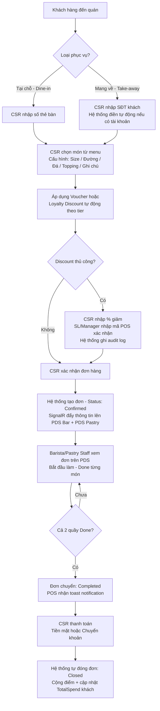
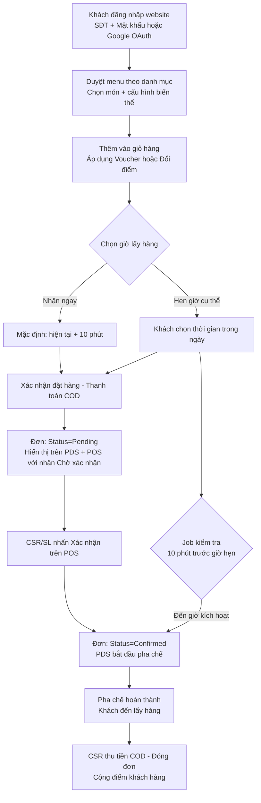
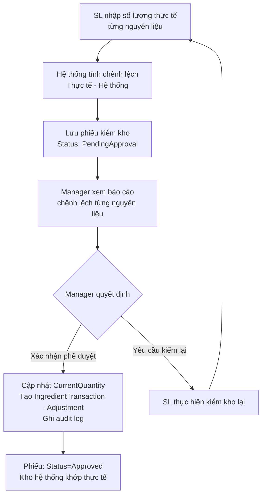
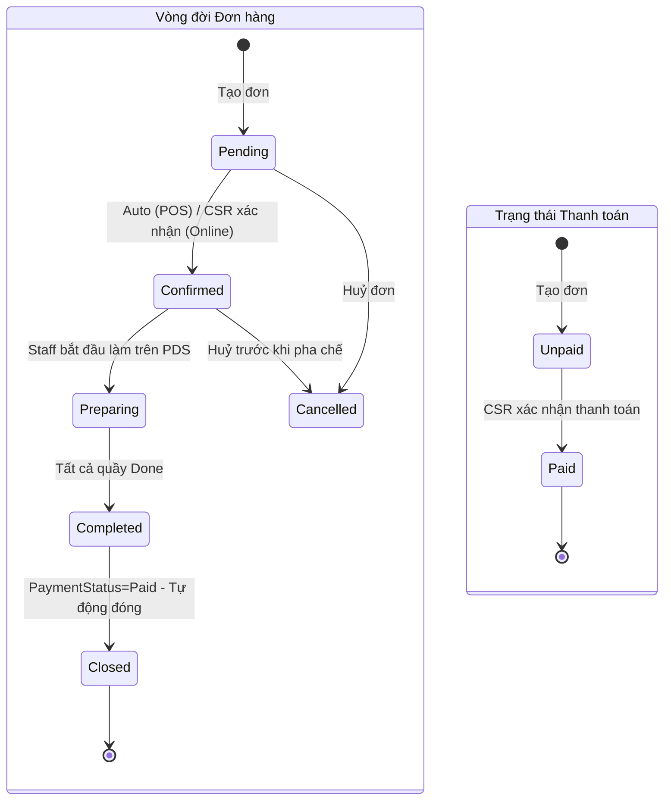
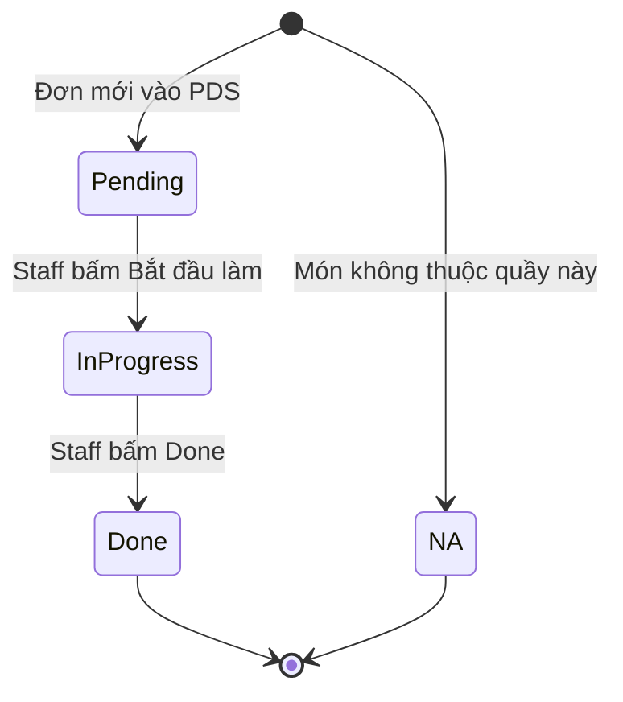
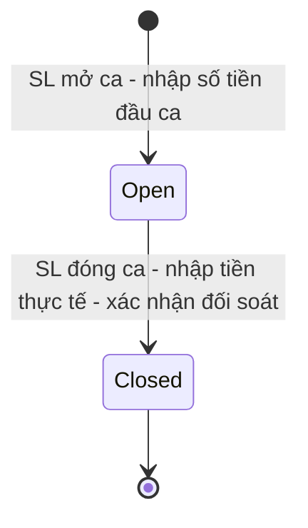
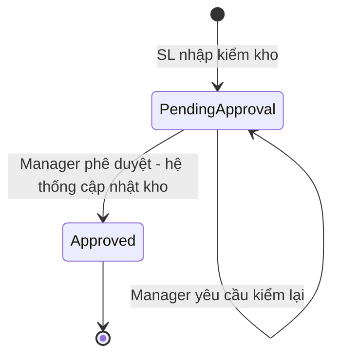

# TÀI LIỆU ĐẶC TẢ YÊU CẦU PHẦN MỀM (SRS) — CafePOS
## Hệ thống Quản lý Bán hàng Quán Cà phê / Trà sữa

| Thuộc tính | Giá trị |
|-----------|---------|
| **Tên hệ thống** | CafePOS |
| **Phiên bản SRS** | 1.0 |
| **Ngày tạo** | 17/06/2026 |
| **Trạng thái** | Đã xác nhận — Sẵn sàng phát triển |
| **Nền tảng** | Web (ASP.NET Core 8 + SQL Server) |
| **Kiến trúc** | API-first (RESTful + SignalR) |

---

## MỤC LỤC

1. [Giới thiệu](#phần-1-giới-thiệu)
2. [Yêu cầu mức tổng thể](#phần-2-yêu-cầu-mức-tổng-thể)
3. [Yêu cầu bảo mật & Phân quyền](#phần-3-yêu-cầu-bảo-mật--phân-quyền)
4. [Đặc tả Use Case](#phần-4-đặc-tả-use-case)
5. [Thiết kế màn hình](#phần-5-thiết-kế-màn-hình)
6. [Yêu cầu khác](#phần-6-các-yêu-cầu-khác)

---

## PHẦN 1: GIỚI THIỆU (INTRODUCTION)

### 1.1 Mục đích (Purpose)

Tài liệu Đặc tả Yêu cầu Phần mềm (SRS) này xác định chi tiết, đầy đủ và có hệ thống các yêu cầu chức năng và phi chức năng của hệ thống quản lý và bán hàng **CafePOS** dành cho quán cà phê / trà sữa. Tài liệu này là cơ sở cốt lõi giúp các bộ phận Phát triển (Dev), Kiểm thử (QA/QC), Quản trị dự án (PM/PO) và Stakeholder thống nhất về phạm vi tính năng, kiến trúc dữ liệu và tiêu chuẩn vận hành của hệ thống.

Tài liệu được xây dựng dựa trên kết quả Stakeholder Interview thực hiện trong Sprint 0 (ngày 11/06/2026), đã được Stakeholder xác nhận và phê duyệt chính thức.

### 1.2 Tổng quan ứng dụng (Application Overview)

**CafePOS** là hệ thống quản lý vận hành chuyên sâu dành cho quán cà phê / trà sữa quy mô vừa và nhỏ, xây dựng trên nền tảng **Web** và vận hành **local** (có thể mở rộng lên Cloud sau này). Hệ thống số hóa toàn bộ quy trình từ tiếp nhận order, điều phối pha chế, thanh toán, quản lý khách hàng thân thiết, kiểm soát tồn kho nguyên liệu đến báo cáo vận hành theo ca và doanh thu chi tiết cho chủ quán.

**Mục đích chính:**
- Loại bỏ hoàn toàn quy trình viết tay và nhận order qua điện thoại, giảm thiểu tình trạng miss order
- Tối ưu hóa tốc độ truyền thông giữa quầy thu ngân → quầy Bar → quầy Đồ ăn nhẹ
- Cung cấp báo cáo doanh thu tức thời và theo lịch sử để ra quyết định kinh doanh
- Xây dựng chương trình khách hàng thân thiết (loyalty) và khuyến mãi linh hoạt
- Chuẩn bị kiến trúc API-first để dễ dàng mở rộng sang ứng dụng mobile trong tương lai

**Các phân hệ cốt lõi:**

| Phân hệ | Mô tả | Đối tượng sử dụng |
|---------|-------|------------------|
| **POS (Point of Sale)** | Đặt hàng, thanh toán, quản lý ca | Cashier, Shift Leader |
| **PDS (Production Display Screen)** | Hiển thị đơn hàng real-time cho pha chế | Barista, Pastry Staff |
| **Online Ordering Website** | Đặt hàng trực tuyến, theo dõi đơn | Khách hàng |
| **Admin Dashboard** | Quản lý menu, nhân viên, báo cáo, khuyến mãi | Owner/Manager |
| **Shift Management** | Mở/đóng ca, đối soát két tiền | Shift Leader |

### 1.3 Đối tượng đọc tài liệu (Intended Audience)

- **Lập trình viên (Developers):** Sử dụng để phát triển database schema, APIs (ASP.NET Core), và giao diện Razor Pages
- **Đội ngũ kiểm thử (QA/QC):** Sử dụng các đặc tả nghiệp vụ và tiêu chí nghiệm thu để thiết lập Test Cases
- **Chủ quán / Stakeholder:** Sử dụng để nắm rõ luồng vận hành và làm căn cứ nghiệm thu bàn giao
- **BA / PM:** Tài liệu gốc để quản lý phạm vi và theo dõi tiến độ Sprint

### 1.4 Chữ viết tắt (Abbreviations)

| Viết tắt | Giải nghĩa |
|---------|-----------|
| **SRS** | Software Requirements Specification — Đặc tả Yêu cầu Phần mềm |
| **POS** | Point of Sale — Điểm bán hàng |
| **PDS** | Production Display Screen — Màn hình hiển thị pha chế |
| **RBAC** | Role-Based Access Control — Kiểm soát truy cập theo vai trò |
| **JWT** | JSON Web Token — Cơ chế xác thực không trạng thái |
| **CSR** | Cashier — Thu ngân |
| **SL** | Shift Leader — Trưởng ca |
| **API** | Application Programming Interface |
| **ERD** | Entity Relationship Diagram — Sơ đồ quan hệ thực thể |
| **BRD** | Business Requirements Document — Tài liệu yêu cầu nghiệp vụ |
| **COD** | Cash On Delivery — Thanh toán khi nhận hàng |
| **OAuth** | Open Authorization — Giao thức xác thực mở (Google) |
| **SignalR** | Thư viện real-time của ASP.NET Core (WebSocket) |

### 1.5 Tài liệu tham khảo (References)

| Tài liệu | Phiên bản | Ngày |
|---------|----------|------|
| `sprint0_brd.md` — Business Requirements Document | v1.2 | 11/06/2026 |
| `sprint0_erd.md` — Entity Relationship Diagram | v1.1 | 11/06/2026 |
| `sprint0_api_contract.md` — API Contract | v1.1 | 11/06/2026 |
| `sprint0_wireframes.md` — Wireframes | v1.0 | 11/06/2026 |
| Kết quả Stakeholder Interview Sprint 0 | — | 11/06/2026 |

---

## PHẦN 2: YÊU CẦU MỨC TỔNG THỂ (HIGH LEVEL REQUIREMENT)

### 2.1 Biểu đồ quan hệ đối tượng (Entity Relationship Diagram)

Biểu đồ mô tả cấu trúc dữ liệu gồm **20 thực thể** chính của hệ thống CafePOS, phân thành 5 nhóm chức năng: Identity & Staff, Menu & Products, Orders, Loyalty & Voucher, Shift & Inventory.

```mermaid
erDiagram
    Staffs {
        int Id PK
        string FullName
        string Phone
        string Email
        string PosCode "Mã đăng nhập POS - bcrypt hashed"
        string PasswordHash "Cho Admin Dashboard"
        string Role "Owner|ShiftLeader|Cashier|Barista|PastryStaff"
        decimal BaseSalary
        string Status "Active|Inactive"
        datetime CreatedAt
    }
    Customers {
        int Id PK
        string FullName
        string Phone
        string Email
        string GoogleId "Null nếu đăng ký bằng SĐT"
        string PasswordHash
        decimal TotalSpend "Cộng dồn vĩnh viễn - tính tier"
        string LoyaltyTier "None|Silver|Gold"
        int CurrentPoints "Reset mỗi 2 tháng"
        datetime PointsResetAt
        datetime CreatedAt
    }
    Categories {
        int Id PK
        string Name
        string DisplayStation "Bar|Pastry|Both"
        int DisplayOrder
        bool IsActive
    }
    Products {
        int Id PK
        int CategoryId FK
        string Name
        string Description
        string ImageUrl
        decimal BasePrice
        string Status "Active|Inactive|OutOfStock"
        bool HasSizeOption
        bool HasSugarOption
        bool HasIceOption
        datetime CreatedAt
    }
    ProductSizes {
        int Id PK
        int ProductId FK
        string SizeLabel "S|M|L"
        decimal PriceModifier
        bool IsDefault
    }
    Toppings {
        int Id PK
        string Name
        decimal Price
        bool IsActive
        datetime CreatedAt
    }
    Orders {
        int Id PK
        string OrderCode "CF-YYMMDD-SEQ"
        string Type "DineIn|TakeAway|Online"
        string TableNumber "Null nếu TakeAway/Online"
        int SubOrderIndex "1=gốc, 2+=gọi thêm"
        int ParentOrderId FK
        int CustomerId FK
        int StaffId FK
        string CustomerName
        string CustomerPhone
        string Status "Pending|Confirmed|Preparing|Completed|Closed|Cancelled"
        string PaymentStatus "Unpaid|Paid"
        string PaymentMethod "Cash|Transfer|Mixed"
        decimal SubTotal
        decimal DiscountAmount
        decimal TotalAmount
        decimal AmountReceived
        decimal AmountChange
        datetime ScheduledPickupTime
        datetime ConfirmedAt
        datetime CompletedAt
        datetime ClosedAt
        datetime CreatedAt
    }
    OrderItems {
        int Id PK
        int OrderId FK
        int ProductId FK
        int Quantity
        decimal UnitPrice "Giá tại thời điểm đặt"
        decimal ItemTotal
        string Notes
        string SizeLabel "S|M|L"
        string SugarLevel "0|30|50|70|Extra"
        string IceLevel "0|50|100"
        bool IsPointRedemption "true = giá 0đ"
        string BarStatus "NA|Pending|InProgress|Done"
        string PastryStatus "NA|Pending|InProgress|Done"
    }
    OrderItemToppings {
        int Id PK
        int OrderItemId FK
        int ToppingId FK
        decimal ToppingPrice "Giá topping tại thời điểm đặt"
    }
    OrderDiscounts {
        int Id PK
        int OrderId FK
        string DiscountType "Loyalty|Voucher|Manual"
        decimal DiscountValue
        string DiscountDescription
        int VoucherId FK
        int ApprovedByStaffId FK
        datetime ApprovedAt
    }
    LoyaltyTierConfigs {
        int Id PK
        string TierName
        decimal MinSpendThreshold
        decimal DiscountPercent
        bool IsActive
    }
    Vouchers {
        int Id PK
        string Code
        string DiscountType "Percent|Fixed"
        decimal DiscountValue
        decimal MinOrderValue
        int MaxUsageCount "Null = không giới hạn"
        int UsedCount
        bool IsPermanent
        datetime ExpiresAt
        bool IsActive
        int CreatedByStaffId FK
        datetime CreatedAt
    }
    VoucherUsages {
        int Id PK
        int VoucherId FK
        int OrderId FK
        int CustomerId FK
        datetime UsedAt
    }
    PointProducts {
        int Id PK
        string Name
        int PointCost
        int LinkedProductId FK
        bool IsActive
        datetime CreatedAt
    }
    PointTransactions {
        int Id PK
        int CustomerId FK
        int OrderId FK
        string TransactionType "Earn|Redeem|Reset"
        int Points
        string Description
        datetime CreatedAt
    }
    Shifts {
        int Id PK
        datetime ShiftDate
        int OpenedByStaffId FK
        int ClosedByStaffId FK
        datetime OpenedAt
        datetime ClosedAt
        decimal OpeningCash
        decimal ExpectedCash
        decimal ExpectedTransfer
        decimal ActualCash
        decimal ActualTransfer
        decimal CashDifference
        decimal TransferDifference
        string Notes
        string Status "Open|Closed"
    }
    Ingredients {
        int Id PK
        string Name
        string Unit "kg|lít|gói|hộp"
        decimal CurrentQuantity
        decimal MinAlertQuantity
        int ExpiryAlertDays
        datetime ExpiresAt
        bool IsActive
        datetime CreatedAt
    }
    InventoryChecks {
        int Id PK
        int ShiftId FK
        int StaffId FK
        datetime CheckedAt
        string Status "PendingApproval|Approved"
        int ApprovedByStaffId FK
        datetime ApprovedAt
        string Notes
    }
    InventoryCheckItems {
        int Id PK
        int InventoryCheckId FK
        int IngredientId FK
        decimal SystemQuantity
        decimal ActualQuantity
        decimal Difference
    }
    IngredientTransactions {
        int Id PK
        int IngredientId FK
        string TransactionType "StockIn|SaleDeduct|Adjustment"
        decimal Quantity
        int RelatedOrderId FK
        int CreatedByStaffId FK
        string Notes
        datetime CreatedAt
    }

    Categories ||--o{ Products : "có"
    Products ||--o{ ProductSizes : "có"
    Orders ||--o{ OrderItems : "chứa"
    Orders }o--o| Customers : "đặt bởi"
    Orders }o--|| Staffs : "tạo bởi"
    Orders }o--o| Orders : "sub-order của"
    OrderItems }o--|| Products : "tham chiếu"
    OrderItems ||--o{ OrderItemToppings : "có"
    OrderItemToppings }o--|| Toppings : "là"
    Orders ||--o{ OrderDiscounts : "có"
    OrderDiscounts }o--o| Vouchers : "dùng"
    OrderDiscounts }o--o| Staffs : "xác nhận bởi"
    PointTransactions }o--|| Customers : "thuộc về"
    PointTransactions }o--o| Orders : "từ đơn"
    PointProducts }o--|| Products : "đổi thành"
    VoucherUsages }o--|| Vouchers : "dùng"
    VoucherUsages }o--o| Orders : "trong đơn"
    VoucherUsages }o--o| Customers : "bởi khách"
    Vouchers }o--|| Staffs : "tạo bởi"
    Shifts }o--|| Staffs : "mở bởi"
    Shifts }o--o| Staffs : "đóng bởi"
    InventoryChecks }o--|| Shifts : "trong ca"
    InventoryChecks }o--|| Staffs : "thực hiện bởi"
    InventoryChecks ||--o{ InventoryCheckItems : "chứa"
    InventoryCheckItems }o--|| Ingredients : "kiểm tra"
    IngredientTransactions }o--|| Ingredients : "cho"
    IngredientTransactions }o--o| Orders : "từ"
    IngredientTransactions }o--o| Staffs : "bởi"
```



---

### 2.2 Biểu đồ luồng công việc (Workflow Diagram)

#### 2.2.1 Luồng bán hàng tại POS (Dine-in & Take-away)



#### 2.2.2 Luồng đặt hàng Online (Customer Website)



#### 2.2.3 Luồng Kiểm kho 2 bước



---

### 2.3 Biểu đồ chuyển đổi trạng thái (State Transition Diagram)

#### 2.3.1 Vòng đời đơn hàng (Order Lifecycle)



> **Quy tắc đóng đơn tự động:** `Status = Completed` AND `PaymentStatus = Paid` → Hệ thống tự cập nhật `Status = Closed`, `ClosedAt = now()`

#### 2.3.2 Trạng thái món trên PDS (OrderItem Station Status)



#### 2.3.3 Trạng thái Ca làm việc (Shift)



#### 2.3.4 Trạng thái Phiếu kiểm kho (InventoryCheck)



---

### 2.4 Biểu đồ Use Case (Use Case Diagram)

```mermaid
flowchart LR
    Customer((Khách hàng))
    Cashier((Thu ngân\nCSR))
    Barista((Barista))
    Pastry((Pastry\nStaff))
    ShiftLeader((Shift Leader\nSL))
    Manager((Manager\nOwner))

    subgraph POS["🖥️ POS — Bán hàng tại quầy"]
        direction LR
        UC01(["UC-01: Đăng nhập POS bằng mã code"])
        UC02(["UC-02: Tạo đơn Dine-in"])
        UC03(["UC-03: Tạo đơn Take-away"])
        UC04(["UC-04: Chọn món và cấu hình biến thể"])
        UC05(["UC-05: Gọi thêm món vào bàn đang mở"])
        UC06(["UC-06: Áp dụng Voucher"])
        UC07(["UC-07: Áp dụng Loyalty Discount tự động"])
        UC08(["UC-08: Discount thủ công + xác nhận SL"])
        UC09(["UC-09: Thanh toán tiền mặt"])
        UC10(["UC-10: Thanh toán chuyển khoản"])
        UC11(["UC-11: Xác nhận đơn hàng Online"])
        UC12(["UC-12: Sửa / Xoá món đơn Online chưa confirm"])
        UC13(["UC-13: Huỷ đơn hàng"])
        UC14(["UC-14: Xem lịch sử đơn trong ca"])
    end

    subgraph PDS["📺 PDS — Màn hình pha chế"]
        direction LR
        UC20(["UC-20: Xem danh sách đơn real-time"])
        UC21(["UC-21: Bắt đầu làm món"])
        UC22(["UC-22: Đánh dấu Done từng món"])
        UC23(["UC-23: Hoàn thành toàn bộ quầy"])
        UC24(["UC-24: Cấu hình chế độ hiển thị PDS"])
    end

    subgraph Online["🌐 Online Ordering — Website khách hàng"]
        direction LR
        UC30(["UC-30: Đăng ký tài khoản"])
        UC31(["UC-31: Đăng nhập SĐT hoặc Google"])
        UC32(["UC-32: Duyệt menu và thêm vào giỏ"])
        UC33(["UC-33: Chọn giờ lấy hàng"])
        UC34(["UC-34: Áp dụng Voucher / Đổi điểm"])
        UC35(["UC-35: Đặt hàng online - Thanh toán COD"])
        UC36(["UC-36: Theo dõi trạng thái đơn real-time"])
        UC37(["UC-37: Xem lịch sử đơn hàng"])
        UC38(["UC-38: Xem điểm thưởng và hạng thành viên"])
    end

    subgraph Shift["⏱️ Shift — Quản lý ca làm việc"]
        direction LR
        UC40(["UC-40: Mở ca - nhập tiền đầu ca"])
        UC41(["UC-41: Xem doanh thu tức thời trong ca"])
        UC42(["UC-42: Nhập kiểm kho thủ công"])
        UC43(["UC-43: Đóng ca - đối soát két tiền"])
        UC44(["UC-44: Xuất báo cáo tổng kết ca"])
    end

    subgraph Admin["⚙️ Admin Dashboard — Quản trị hệ thống"]
        direction LR
        UC50(["UC-50: Quản lý danh mục sản phẩm"])
        UC51(["UC-51: Quản lý sản phẩm và biến thể"])
        UC52(["UC-52: Quản lý Topping"])
        UC53(["UC-53: Cấu hình danh mục hiển thị PDS"])
        UC54(["UC-54: Quản lý nhân viên và mã POS"])
        UC55(["UC-55: Quản lý Voucher / Coupon"])
        UC56(["UC-56: Cấu hình chương trình Loyalty"])
        UC57(["UC-57: Quản lý sản phẩm đổi điểm"])
        UC58(["UC-58: Quản lý nguyên liệu tồn kho"])
        UC59(["UC-59: Duyệt phiếu kiểm kho - 2 bước"])
        UC60(["UC-60: Báo cáo doanh thu theo ngày/tuần/tháng"])
        UC61(["UC-61: Báo cáo doanh thu theo khung giờ"])
        UC62(["UC-62: Báo cáo sản phẩm bán chạy / bán ít"])
        UC63(["UC-63: Báo cáo Voucher"])
        UC64(["UC-64: Báo cáo Loyalty và điểm khách"])
        UC65(["UC-65: Báo cáo tồn kho và cảnh báo"])
    end

    Cashier     --> POS
    ShiftLeader --> POS
    ShiftLeader --> Shift
    Barista     --> PDS
    Pastry      --> PDS
    Manager     --> PDS
    Manager     --> Admin
    Customer    --> Online
```



---

## PHẦN 3: YÊU CẦU BẢO MẬT & PHÂN QUYỀN (SECURITY REQUIREMENT)

### 3.1 Cơ chế xác thực (Authentication Mechanisms)

| Phương thức | Áp dụng cho | Cơ chế kỹ thuật |
|------------|------------|----------------|
| **Mã code POS** | CSR, SL, Barista, Pastry | Nhập mã số (ví dụ: `2018000520`) → Validate bcrypt hash → JWT ngắn hạn (8h) |
| **Username + Password** | Owner, Manager | ASP.NET Identity → JWT (24h) + Refresh Token |
| **SĐT + Password** | Customer | Custom auth → JWT (7 ngày) |
| **Google OAuth 2.0** | Customer | OAuth 2.0 Authorization Code Flow → JWT |
| **Mã xác nhận discount** | SL, Manager | Nhập lại POS code → Validate role tại thời điểm thao tác |

### 3.2 Ma trận phân quyền (RBAC Matrix)

| Chức năng | Owner / Manager | Shift Leader | Cashier | Barista | Pastry Staff | Customer |
|-----------|:--------------:|:------------:|:-------:|:-------:|:------------:|:--------:|
| **POS — Bán hàng** | | | | | | |
| Tạo đơn Dine-in / Take-away | ✅ | ✅ | ✅ | — | — | — |
| Chọn món + cấu hình biến thể | ✅ | ✅ | ✅ | — | — | — |
| Gọi thêm món vào bàn | ✅ | ✅ | ✅ | — | — | — |
| Áp dụng Voucher | ✅ | ✅ | ✅ | — | — | — |
| Áp dụng Loyalty Discount | ✅ | ✅ | ✅ | — | — | — |
| Nhập % Discount thủ công | ✅ | ✅ | ✅ nhập | — | — | — |
| **Xác nhận discount thủ công** | ✅ code | ✅ code | ❌ | — | — | — |
| Thanh toán Cash / CK | ✅ | ✅ | ✅ | — | — | — |
| Xác nhận đơn hàng Online | ✅ | ✅ | ✅ | — | — | — |
| Sửa / Xoá món đơn Online | ✅ | ✅ | ✅ | — | — | — |
| Huỷ đơn hàng | ✅ | ✅ | ✅ | — | — | — |
| **PDS — Pha chế** | | | | | | |
| Xem PDS Bar | — | — | — | ✅ | — | — |
| Xem PDS Pastry | — | — | — | — | ✅ | — |
| Đánh dấu Done món | — | — | — | ✅ | ✅ | — |
| Hoàn thành quầy | — | — | — | ✅ | ✅ | — |
| Cấu hình chế độ hiển thị PDS | ✅ | — | — | — | — | — |
| **Ca làm việc** | | | | | | |
| Mở ca (nhập tiền đầu ca) | ✅ | ✅ | — | — | — | — |
| Xem doanh thu tức thời | ✅ | ✅ | — | — | — | — |
| Nhập kiểm kho (Bước 1) | ✅ | ✅ | — | — | — | — |
| Đóng ca (đối soát két tiền) | ✅ | ✅ | — | — | — | — |
| Xuất báo cáo ca | ✅ | ✅ | — | — | — | — |
| **Admin Dashboard** | | | | | | |
| Quản lý Menu — CRUD | ✅ | — | — | — | — | — |
| Cấu hình PDS theo danh mục | ✅ | — | — | — | — | — |
| Quản lý Nhân viên — CRUD | ✅ | — | — | — | — | — |
| Quản lý Voucher — CRUD | ✅ | — | — | — | — | — |
| Cấu hình Loyalty | ✅ | — | — | — | — | — |
| Quản lý Tồn kho — CRUD | ✅ | — | — | — | — | — |
| **Duyệt phiếu kiểm kho (Bước 2)** | ✅ | — | — | — | — | — |
| Báo cáo đầy đủ | ✅ | Giới hạn ca | — | — | — | — |
| **Online Ordering** | | | | | | |
| Duyệt menu, đặt hàng online | — | — | — | — | — | ✅ |
| Xem lịch sử đơn | — | — | — | — | — | ✅ |
| Xem / dùng điểm thưởng | — | — | — | — | — | ✅ |

> **Ghi chú ký hiệu:** ✅ = Có quyền | ❌ = Bị từ chối | — = Không áp dụng

### 3.3 Bảo mật dữ liệu nhạy cảm

| Dữ liệu | Phương thức bảo vệ |
|--------|------------------|
| POS Code của Staff | bcrypt hash, không lưu plaintext |
| Password Staff/Customer | ASP.NET Identity PasswordHasher (PBKDF2) |
| JWT Token | HS256 signed, có expiry ngắn |
| Thông tin khách hàng | Không log SĐT/email trong error log |

### 3.4 Audit Log bắt buộc

| Thao tác | Trường cần ghi lại |
|---------|-------------------|
| Áp dụng discount thủ công | StaffId CSR, StaffId approver, % discount, OrderId, timestamp |
| Mở ca | StaffId SL, OpeningCash, timestamp |
| Đóng ca | StaffId SL, ActualCash, ActualTransfer, CashDifference, timestamp |
| Huỷ đơn hàng | StaffId, OrderId, Reason, timestamp |
| Xoá / Đổi món đơn Online | StaffId, OrderId, ItemId, trạng thái trước/sau, timestamp |
| Duyệt phiếu kiểm kho | ManagerId, CheckId, số nguyên liệu điều chỉnh, timestamp |

---

## PHẦN 4: ĐẶC TẢ USE CASE (USE CASE SPECIFICATION)

### UC-02: Tạo đơn Dine-in tại POS

- **Actor:** Thu ngân (Cashier), Shift Leader
- **Pre-conditions:** Người dùng đã đăng nhập POS bằng mã code thành công. Ca làm việc đang ở trạng thái Open.
- **Normal Flow:**
  1. CSR nhấn nút **"+ Đơn mới"** trên màn hình POS chính.
  2. Hệ thống hiển thị popup chọn loại đơn: **Tại chỗ** / **Mang về**.
  3. CSR chọn **Tại chỗ**. Field nhập số thẻ bàn xuất hiện.
  4. CSR nhập số thẻ bàn (ví dụ: `05`). Trường này có thể để trống.
  5. Màn hình chọn món mở ra với sidebar danh mục (Tất cả | Trà Sữa | Cà Phê | Đồ Ăn Nhẹ...).
  6. CSR chọn sản phẩm từ grid → Popup cấu hình biến thể xuất hiện:
     - Size: S / M / L (giá tự cộng theo PriceModifier)
     - Đường: 0% / 30% / 50% / 70% / Thêm đường
     - Đá: Không đá / 50% / 100%
     - Topping: Danh sách checkbox kèm giá từng loại
     - Số lượng: Stepper (−/+)
     - Ghi chú: Text input tự do
  7. CSR nhấn **"Thêm vào đơn"**. Món xuất hiện trong giỏ hàng bên phải.
  8. Lặp lại bước 6–7 cho các món tiếp theo.
  9. Nếu CSR nhập SĐT khách → Hệ thống tra cứu và hiển thị tier loyalty (Silver/Gold), discount tương ứng.
  10. CSR áp dụng voucher hoặc discount loyalty (tuỳ chọn). Hệ thống recalculate tổng tiền real-time.
  11. CSR nhấn **"Xác nhận đơn"**.
  12. Hệ thống:
      - Tạo `Order` với `Status = Confirmed`, `PaymentStatus = Unpaid`
      - Sinh `OrderCode` theo format `CF{YYMMDD}{SEQ:4}`
      - Ghi `OrderItems` với `UnitPrice` tại thời điểm đặt
      - Phát sự kiện `OrderCreated` qua SignalR đến PDS Bar và PDS Pastry
  13. Màn hình POS quay về danh sách đơn. Đơn mới hiển thị ở đầu danh sách.
- **Alternate Flow — Gọi thêm món vào bàn đang mở:**
  1. CSR chọn đơn đang mở → Nhấn **"Gọi thêm món"**.
  2. Hệ thống tạo sub-order với `SubOrderIndex = n+1`, `ParentOrderId = OrderId gốc`.
  3. PDS hiển thị mã sub-order: `CF2406110001/2`.
- **Post-conditions:** Đơn `Status = Confirmed`. PDS Bar và PDS Pastry nhận thông tin món real-time qua SignalR trong < 1 giây.
- **Exception Flow:**
  - Sản phẩm `Status = OutOfStock` → Badge "Hết hàng", nút thêm bị vô hiệu hóa.
  - Không chọn size khi sản phẩm `HasSizeOption = true` → Hệ thống tự chọn size mặc định (`IsDefault = true`).

---

### UC-08: Discount thủ công với xác nhận SL/Manager

- **Actor:** Thu ngân (CSR) — khởi tạo; Shift Leader / Manager — xác nhận bằng mã
- **Pre-conditions:** Đơn hàng `PaymentStatus = Unpaid`. CSR đang ở màn hình thanh toán.
- **Normal Flow:**
  1. CSR nhấn biểu tượng **"Giảm giá thêm"** trên màn hình thanh toán.
  2. Dialog nhập giảm giá thủ công xuất hiện:
     - Input số: `% giảm giá` (giá trị từ 1 đến 100)
     - Preview real-time: "Giảm X.000đ — Còn lại Y.000đ"
  3. CSR nhập mức giảm và nhấn **"Tiếp tục"**.
  4. Hệ thống chuyển sang màn hình xác nhận: **"Nhờ SL hoặc Quản lý nhập mã xác nhận"**.
  5. SL/Manager tiếp cận máy POS, nhập **mã code POS cá nhân** của họ.
  6. Hệ thống validate:
     - Mã code hợp lệ (khớp bcrypt hash)
     - Role của người nhập ≥ `ShiftLeader`
  7. Nếu hợp lệ:
     - Tạo `OrderDiscount` với `DiscountType = Manual`, `ApprovedByStaffId`, `ApprovedAt = now()`
     - Ghi audit log đầy đủ
  8. Màn hình thanh toán cập nhật tổng tiền mới. Hiển thị nhãn "Giảm giá đặc biệt: X%".
- **Post-conditions:** Discount được áp dụng. Audit trail đầy đủ trong `OrderDiscounts`.
- **Exception Flow:**
  - Mã code không hợp lệ → Thông báo lỗi "Mã không đúng", cho nhập lại (tối đa 3 lần).
  - Nhập mã của Cashier (role không đủ) → Hệ thống từ chối, hiển thị "Không đủ quyền".

---

### UC-11: Xác nhận và xử lý đơn hàng Online

- **Actor:** Thu ngân (Cashier), Shift Leader
- **Pre-conditions:** Có đơn `Status = Pending`, `Type = Online` trên hệ thống.
- **Normal Flow:**
  1. Đơn online xuất hiện trên POS và PDS với nhãn **"Chờ xác nhận"** + âm thanh và visual alert.
  2. CSR/SL xem thông tin: Tên khách, SĐT, danh sách món, giờ lấy hẹn, tổng tiền.
  3. CSR/SL nhấn **"Xác nhận đơn"**.
  4. Hệ thống cập nhật `Status = Confirmed`, phát SignalR đến PDS.
  5. Website khách hàng nhận update real-time: "Đơn đang được chuẩn bị".
- **Alternate Flow — Có vấn đề với đơn hàng (hết nguyên liệu, không thể làm):**
  > ⚠️ Hệ thống KHÔNG hỗ trợ notification tự động đến khách. Toàn bộ liên lạc là thủ công.
  1. CSR/SL liên hệ khách bằng điện thoại hoặc tin nhắn ngoài hệ thống.
  2. Tuỳ theo thoả thuận với khách:
     - **Khách đồng ý đổi món:** CSR/SL nhấn "Sửa đơn" → Xoá món cũ → Thêm món mới → Xác nhận đơn bình thường.
     - **Khách huỷ một món:** CSR/SL nhấn "Xoá món" cạnh món cần huỷ → Nhập lý do → Hệ thống recalculate tổng.
     - **Khách huỷ cả đơn:** CSR/SL nhấn "Huỷ đơn" → Nhập lý do → `Status = Cancelled` → Hoàn lại điểm nếu đã dùng.
- **Post-conditions:** Đơn được xử lý phù hợp. Khách thấy trạng thái cập nhật trên website.

---

### UC-23: Hoàn thành quầy trên PDS

- **Actor:** Barista (PDS Bar) hoặc Pastry Staff (PDS Pastry)
- **Pre-conditions:** Có đơn `Status = Confirmed` hiển thị trên màn hình PDS của quầy.
- **Normal Flow:**
  1. Đơn mới xuất hiện với border **vàng** (Pending) và hiển thị:
     - Mã đơn: `CF2406110001/1`
     - Loại đơn + Số bàn (nếu Dine-in)
     - Timer chờ tính từ khi Confirmed
     - Danh sách món thuộc quầy này (kèm size, đường, đá, topping, ghi chú)
  2. Staff nhấn **"Bắt đầu làm"** → Border chuyển **xanh dương** (InProgress).
  3. Staff làm từng món và nhấn checkbox ✓ để đánh dấu Done từng món.
  4. Tất cả món trong quầy Done → Nút **"HOÀN THÀNH QUẦY"** sáng lên (màu xanh lá, nổi bật).
  5. Staff nhấn "HOÀN THÀNH QUẦY" → Border chuyển **xanh lá** (Done).
  6. Hệ thống kiểm tra cả 2 quầy:
     - Nếu cả Bar và Pastry Done → Cập nhật `Order.Status = Completed`
     - Phát SignalR event `OrderCompleted` đến POS
  7. POS hiển thị toast notification: **"Đơn CF2406110001 đã hoàn thành ✓"** trong 5 giây.
- **Post-conditions:** Đơn `Completed`. POS được thông báo real-time để thu ngân tiến hành thanh toán.
- **Business Rule:** Đơn chỉ có món Bar (không có Pastry) → Tất cả `PastryStatus = NA` → Completed khi Bar Done.

---

### UC-35: Đặt hàng Online (Customer)

- **Actor:** Khách hàng (Customer) đã đăng nhập tài khoản
- **Pre-conditions:** Khách đã có tài khoản và đang đăng nhập. Website đang mở.
- **Normal Flow:**
  1. Khách vào trang menu → Chọn danh mục → Xem sản phẩm.
  2. Nhấn sản phẩm → Popup biến thể: Size / Đường / Đá / Topping / Số lượng.
  3. Nhấn **"Thêm vào giỏ"** → Icon giỏ hàng cập nhật số lượng và tổng.
  4. Lặp lại bước 2–3 cho các món tiếp theo.
  5. Vào trang giỏ hàng:
     - Xem danh sách món, chỉnh sửa nếu cần
     - Nhập mã voucher (tuỳ chọn) → Validate → Hiển thị số tiền giảm
     - Chọn sản phẩm đổi điểm (tuỳ chọn) từ danh sách PointProduct
     - Loyalty discount tự động hiển thị nếu tier Silver/Gold
  6. Chọn **giờ lấy hàng:**
     - **Nhận ngay:** Hệ thống hiển thị "Dự kiến ~10 phút"
     - **Hẹn giờ:** Khách chọn giờ cụ thể (trong giờ mở cửa, trong ngày)
  7. Nhấn **"Đặt hàng"** → Hệ thống xác nhận lại đơn.
  8. Nhấn **"Xác nhận"** → Hệ thống tạo đơn `Status = Pending`, `PaymentMethod = COD`.
  9. Trang chuyển sang **"Theo dõi đơn hàng"**: Mã đơn, Trạng thái real-time, Thời gian lấy dự kiến.
- **Post-conditions:** Đơn `Pending`. POS/PDS nhận notification. Khách theo dõi real-time qua SignalR.

---

### UC-43: Đóng ca và đối soát két tiền

- **Actor:** Shift Leader
- **Pre-conditions:** Ca đang `Status = Open`. SL đã đăng nhập.
- **Normal Flow:**
  1. SL vào **"Quản lý ca"** → **"Đóng ca"**.
  2. Hệ thống hiển thị bảng tổng kết ca từ dữ liệu hệ thống:
     - Tổng doanh thu trong ca: X đồng
     - Từ tiền mặt: Y đồng → Tiền mặt kỳ vọng trong két: OpeningCash + Y
     - Từ chuyển khoản: Z đồng
     - Tổng số đơn đã đóng: N đơn
     - Tổng discount đã áp dụng
  3. SL đếm tiền mặt thực tế trong két → Nhập vào trường **"Tiền mặt thực tế"**.
  4. SL kiểm tra lịch sử CK → Nhập vào trường **"Chuyển khoản thực tế"**.
  5. Hệ thống tính và hiển thị chênh lệch:
     - `CashDifference = ActualCash − ExpectedCash` (dương: thừa, âm: thiếu)
     - `TransferDifference = ActualTransfer − ExpectedTransfer`
  6. SL nhập ghi chú giải thích chênh lệch (tuỳ chọn).
  7. SL nhấn **"Xác nhận Đóng ca"**.
  8. Hệ thống lưu `Shift.Status = Closed`, `ClosedAt = now()`, `ClosedByStaffId`.
  9. Tạo báo cáo ca tự động. SL xem hoặc xuất file.
- **Post-conditions:** Ca Closed thành công. Manager xem báo cáo ca trong Admin Dashboard.
- **Business Rule:** Không thể mở ca mới nếu đang có ca `Status = Open`.

---

### UC-59: Duyệt phiếu kiểm kho (Bước 2 — Manager)

- **Actor:** Manager / Owner
- **Pre-conditions:** SL đã tạo phiếu kiểm kho `Status = PendingApproval`.
- **Normal Flow:**
  1. Manager vào **"Tồn kho"** → **"Phiếu kiểm kho chờ duyệt"**.
  2. Chọn phiếu cần duyệt → Hệ thống hiển thị bảng chi tiết:

     | Nguyên liệu | Đơn vị | SL hệ thống | SL thực tế | Chênh lệch |
     |------------|--------|------------|-----------|-----------|
     | Trà Oolong | kg | 5.0 | 4.5 | **-0.5** (đỏ) |
     | Sữa đặc | hộp | 20 | 22 | **+2** (vàng) |

  3. Manager xem xét từng dòng chênh lệch, nhập ghi chú lý giải (nếu cần).
  4. Manager nhấn **"Phê duyệt và cập nhật kho"**.
  5. Hệ thống:
     - Cập nhật `Ingredient.CurrentQuantity = ActualQuantity` cho từng nguyên liệu
     - Tạo `IngredientTransaction(Adjustment)` cho từng dòng có chênh lệch
     - Lưu `InventoryCheck.Status = Approved`, `ApprovedByStaffId`, `ApprovedAt`
  6. Ghi audit log đầy đủ.
- **Post-conditions:** `Ingredient.CurrentQuantity` khớp với số thực tế. Audit trail hoàn chỉnh.
- **Business Rule:** Manager không thể chỉnh sửa số liệu SL đã nhập — chỉ có thể phê duyệt hoặc yêu cầu SL kiểm lại.

---

## PHẦN 5: THIẾT KẾ MÀN HÌNH (WIREFRAME)

### 5.1 Màn hình POS — Giao diện đặt hàng (Cashier / Shift Leader)

**Bố cục:**
```
┌─────────────────────────────────────────────────────────────┐
│  👤 Nguyễn CSR  │  Ca: 07:00-15:00  │ [Tại chỗ][Mang về] │ 16:30 │
├───────────────────────────────────┬─────────────────────────┤
│  [Tất cả][Trà Sữa][Cà Phê][Snack]│  🛒 Đơn hiện tại        │
│                                   │  Bàn: 05                │
│  ┌──────┐ ┌──────┐ ┌──────┐      │─────────────────────────│
│  │ 🥤   │ │ ☕   │ │ 🧋   │      │ Trà Sữa Oolong M        │
│  │Trà Sữa│ │Cà Phê│ │Matcha│      │ 50% đường, 50% đá       │
│  │55.000│ │45.000│ │65.000│      │ x1 — 55.000đ  [−][+] 🗑️  │
│  └──────┘ └──────┘ └──────┘      │─────────────────────────│
│  [Hết hàng badge đỏ nếu OutOfStock]                         │
│                                   │ Bánh mì cá ngừ          │
│  ┌──────┐ ┌──────┐ ┌──────┐      │ x2 — 60.000đ  [−][+] 🗑️  │
│  │ 🍞   │ │ 🍰   │ │ 🥤   │      │─────────────────────────│
│  │ B.mì │ │ Bánh │ │Nước ép│     │ 🏷️ Silver: -10%          │
│  │30.000│ │45.000│ │35.000│      │ 🎟️ Voucher: [___] [Áp]  │
│  └──────┘ └──────┘ └──────┘      │─────────────────────────│
│                                   │ Tổng: 115.000đ          │
│                                   │ Giảm:  -11.500đ         │
│                                   │ ──────────────────────  │
│                                   │ THANH TOÁN: 103.500đ   │
│                                   │ [💵 Tiền mặt][🏦 CK]   │
└───────────────────────────────────┴─────────────────────────┘
```

**Theme:** Dark mode — Nền `#0f172a`, accent amber `#f59e0b`, text `#f1f5f9`

**Trạng thái đặc biệt:**
- Sản phẩm OutOfStock: Badge đỏ "Hết hàng", click bị vô hiệu
- Toast "Đơn hoàn thành": Banner xanh lá, top-center, 5 giây, kèm tiếng ding
- Discount thủ công: Modal nhập %, preview, màn hình nhập mã xác nhận SL

---

### 5.2 Màn hình PDS — Bar Station (Barista)

**Bố cục:**
```
┌─────────────────────────────────────────────────────────────┐
│  🍹 BAR STATION          ⏰ 16:30:45        [3 đơn đang chờ] │
├───────────────┬───────────────┬─────────────────────────────┤
│ CF2406110001  │ CF2406110002  │ CF2406110003                │
│ Tại chỗ Bàn05 │ Mang về       │ Online - Hẹn 17:00         │
│ ⏱️ 08:32      │ ⏱️ 03:14       │ ⏱️ 00:45                   │
│ [BORDER XANH] │ [BORDER VÀNG] │ [BORDER VÀNG]              │
│               │               │                             │
│ ☑ Trà Sữa M  │ □ Cà Phê M    │ □ Matcha Latte L           │
│   50% đ, 50%đ │   Ít đường    │   Không đường               │
│ ☑ Matcha S   │ □ Trà Đào L   │ □ Trà Đào M                │
│   Thêm đường  │   100% đá     │   30% đường                │
│               │               │                             │
│ [✅ HOÀN THÀNH QUẦY]         │                             │
│ (xanh lá, sáng)               │                             │
└───────────────┴───────────────┴─────────────────────────────┘
```

**Color coding border card:**
- 🟡 Vàng `#fbbf24`: Pending — Chờ làm
- 🔵 Xanh dương `#3b82f6`: InProgress — Đang làm
- 🟢 Xanh lá `#22c55e`: Done — Hoàn thành

**Cài đặt Manager:** Chế độ Split (1 màn hình / 2 quầy) hoặc 2 màn hình riêng biệt.

---

### 5.3 Website đặt hàng Online (Customer — Mobile-first)

**Bố cục trang Menu:**
```
┌─────────────────────────┐
│ 🏪 CafePOS    👤 45đ🥈 🛒(2)│
│─────────────────────────│
│ ✨ Đặt ngay, nhận 10 phút│
│    [Đặt hàng ngay]       │
│─────────────────────────│
│[Tất cả][Trà Sữa][Cà Phê]│
│[Snack  ][Nước Ép]        │
│─────────────────────────│
│ ┌──────┐  ┌──────┐      │
│ │  🧋  │  │  ☕  │      │
│ │Matcha│  │Cà Phê│      │
│ │65.000│  │45.000│      │
│ │ [+]  │  │ [+]  │      │
│ └──────┘  └──────┘      │
│─────────────────────────│
│        🛒 2 món — 120k  │
└─────────────────────────┘
```

**Trang giỏ hàng và chọn giờ:**
```
┌─────────────────────────┐
│ ← Giỏ hàng              │
│─────────────────────────│
│ Matcha Latte M    65.000│
│ 50% đường, Không đá     │
│                  [−][+] │
│─────────────────────────│
│ 🎟️ Mã giảm: [______][✓] │
│ 🥈 Silver: −10% −6.500  │
│─────────────────────────│
│ 📦 Đổi điểm:            │
│ [Chọn sản phẩm ▼]       │
│─────────────────────────│
│ ⏰ Giờ lấy hàng:         │
│ (●) Nhận ngay ~10 phút  │
│ (○) Hẹn giờ [17:30 ▼]  │
│─────────────────────────│
│ Tổng:        65.000     │
│ Giảm:        -6.500     │
│ ─────────────────────── │
│ THANH TOÁN:  58.500     │
│                         │
│    [🛒 ĐẶT HÀNG]        │
└─────────────────────────┘
```

**Design:** Cream & coffee brown palette, gold accent `#b7791f`, font Nunito/Inter.

---

### 5.4 Admin Dashboard (Manager — Desktop)

**Bố cục:**
```
┌──────────┬──────────────────────────────────────────────────┐
│ 🏪 Logo  │  Dashboard  >                    [Xuất PDF/Excel] │
│──────────│──────────────────────────────────────────────────│
│ Dashboard│  [ Hôm nay ↑12% ]  [ 45 đơn ]  [ 5 KH mới ]    │
│ Menu     │  [ Doanh thu: 4.2tr] [ Top: Trà Sữa Oolong ]    │
│ Nhân viên│──────────────────────────────────────────────────│
│ Khuyến mãi│              📈 Doanh thu theo giờ             │
│ Tồn kho  │  ████░░░████████░░░████▓▓▓░░░  (7h-22h)        │
│ Ca làm   │──────────────────────────────────────────────────│
│ Báo cáo  │  Top 5 bán chạy          Recent Orders           │
│ Cài đặt  │  1. Trà Sữa Oolong ███  CF001 Bàn5  103k ✅     │
│──────────│  2. Cà Phê Sữa   ██░   CF002 Take  45k  ✅      │
│ 👤 Admin │  3. Matcha Latte  █░░   CF003 Online 58k  ⏳     │
└──────────┴──────────────────────────────────────────────────┘
```

---

## PHẦN 6: CÁC YÊU CẦU KHÁC (OTHER REQUIREMENTS)

### 6.1 Yêu cầu tích hợp (Integration Requirements)

| Tích hợp | Mức độ | Ghi chú |
|---------|-------|--------|
| **SignalR WebSocket** | ✅ Bắt buộc | Real-time PDS updates, POS notifications, Order tracking cho Customer |
| **Google OAuth 2.0** | ✅ Bắt buộc | Đăng nhập Customer bằng tài khoản Google |
| **ASP.NET Identity** | ✅ Bắt buộc | Quản lý tài khoản Staff và Customer |
| **In hoá đơn nhiệt** | ❌ Bỏ qua | Ngoài phạm vi — sẽ xem xét ở giai đoạn sau |
| **Cổng thanh toán điện tử** | ❌ Bỏ qua | Chỉ Cash + Chuyển khoản thủ công trong scope hiện tại |
| **Grab / ShopeeFood** | ❌ Ngoài scope | Không yêu cầu |

### 6.2 Yêu cầu hiệu năng (Performance Requirements)

| Chỉ số | Ngưỡng yêu cầu | Ghi chú |
|-------|--------------|--------|
| POS API response time | < 500ms | Mọi request thông thường |
| SignalR update PDS | < 1 giây | Từ khi CSR confirm đến khi PDS hiển thị |
| Tải trang báo cáo Admin | < 3 giây | |
| Online ordering — First Contentful Paint | < 2 giây | Mobile 4G |
| Scheduled job kích hoạt đơn hẹn giờ | ±30 giây | Độ chính xác chấp nhận được |
| Database query timeout | < 5 giây | |

### 6.3 Kiến trúc hệ thống (System Architecture)

#### 6.3.1 Technology Stack

| Layer | Technology | Chi tiết |
|-------|-----------|---------|
| **Backend API** | ASP.NET Core 8 Web API | RESTful, Swagger/OpenAPI |
| **Real-time** | ASP.NET Core SignalR | WebSocket, fallback Long Polling |
| **ORM** | Entity Framework Core 8 | Code-First, Migrations |
| **Database** | SQL Server 2022 | Local instance |
| **Auth** | ASP.NET Identity + JWT Bearer | Access Token + Refresh Token |
| **Google OAuth** | Microsoft.AspNetCore.Authentication.Google | OAuth 2.0 |
| **Frontend** | Razor Pages (ASP.NET MPA) | POS, PDS, Admin, Customer |
| **Caching** | IMemoryCache | Menu cache, session |
| **Background Jobs** | IHostedService / BackgroundService | Point reset, order scheduling |
| **API Docs** | Swashbuckle (Swagger UI) | Dev & QA |

#### 6.3.2 Cấu trúc dự án (Solution Structure)

```
CafePOS.sln
├── CafePOS.API/                    ← Web API Layer
│   ├── Controllers/
│   │   ├── AuthController.cs
│   │   ├── OrdersController.cs
│   │   ├── ProductsController.cs
│   │   ├── PdsController.cs
│   │   ├── ShiftsController.cs
│   │   ├── InventoryController.cs
│   │   └── ReportsController.cs
│   ├── Hubs/
│   │   └── OrderHub.cs             ← SignalR Hub
│   └── Program.cs
│
├── CafePOS.Application/            ← Business Logic Layer
│   ├── Services/
│   │   ├── OrderService.cs
│   │   ├── PaymentService.cs
│   │   ├── LoyaltyService.cs
│   │   ├── VoucherService.cs
│   │   ├── ShiftService.cs
│   │   ├── InventoryService.cs
│   │   └── ReportService.cs
│   └── DTOs/
│
├── CafePOS.Domain/                 ← Domain Entities & Enums
│   ├── Entities/
│   │   ├── Order.cs, OrderItem.cs
│   │   ├── Product.cs, Category.cs, Topping.cs
│   │   ├── Customer.cs, Staff.cs
│   │   ├── Shift.cs
│   │   ├── Voucher.cs, PointProduct.cs
│   │   └── Ingredient.cs, InventoryCheck.cs
│   └── Enums/
│       ├── OrderStatus.cs
│       ├── StaffRole.cs
│       └── LoyaltyTier.cs
│
├── CafePOS.Infrastructure/         ← Data Access Layer
│   ├── Data/
│   │   ├── AppDbContext.cs
│   │   └── Migrations/
│   └── BackgroundJobs/
│       ├── PointResetJob.cs        ← Reset điểm mỗi 2 tháng
│       └── ScheduledOrderJob.cs    ← Auto-trigger đơn hẹn giờ
│
└── CafePOS.Web/                    ← Razor Pages Frontend
    ├── Pages/
    │   ├── POS/                    ← Màn hình POS
    │   ├── PDS/                    ← Màn hình PDS Bar/Pastry
    │   ├── Admin/                  ← Admin Dashboard
    │   └── Customer/               ← Online ordering website
    └── wwwroot/
```

#### 6.3.3 SignalR Hub Events

| Event Name | Trigger | Receivers | Payload |
|-----------|---------|----------|---------|
| `OrderCreated` | CSR tạo đơn POS | PDS Bar, PDS Pastry | OrderId, items[], tableNumber |
| `OnlinePendingOrder` | Khách đặt online | POS CSR/SL | OrderId, customerName, scheduledTime |
| `OrderConfirmed` | CSR xác nhận online | PDS, Customer Website | OrderId, status |
| `ItemStatusChanged` | Staff Done một món | POS tracking | OrderId, itemId, barStatus/pastryStatus |
| `OrderStationCompleted` | Một quầy hoàn thành | POS, PDS | OrderId, station, allDone |
| `OrderCompleted` | Cả 2 quầy Done | POS | OrderId, orderCode |
| `ScheduledOrderTriggered` | Background job kích hoạt | PDS, POS | OrderId |

### 6.4 Quy tắc nghiệp vụ quan trọng (Key Business Rules)

#### 6.4.1 Hệ thống Loyalty

| Quy tắc | Chi tiết |
|--------|---------|
| Tích điểm | 10.000đ = 1 điểm (làm tròn xuống) |
| Reset điểm | Ngày 1 tháng lẻ (tháng 1, 3, 5, 7, 9, 11) — Background Job |
| Tier Silver | `TotalSpend ≥ 1.000.000đ` → Giảm 10% từ đơn TIẾP THEO |
| Tier Gold | `TotalSpend ≥ 1.500.000đ` → Giảm 15% từ đơn TIẾP THEO |
| Không downgrade | `TotalSpend` chỉ tăng, tier không bao giờ tự giảm |
| Sản phẩm đổi điểm | Xuất hiện trong đơn với `UnitPrice = 0đ`, trừ điểm ngay |
| Hoàn điểm | Đơn Cancelled sau khi đã dùng điểm → Hoàn lại toàn bộ |

#### 6.4.2 Voucher

| Quy tắc | Chi tiết |
|--------|---------|
| Loại giảm | Theo % hoặc số tiền cố định |
| Mặc định | 1 lần dùng, hết hạn sau 1 tháng |
| Tuỳ chọn | Không giới hạn lần / Vĩnh viễn (`IsPermanent = true`) |
| Kết hợp | 1 voucher/đơn, có thể dùng cùng loyalty discount |
| Validate | Hết hạn (`ExpiresAt`), hết lượt (`UsedCount ≥ MaxUsageCount`), giá trị tối thiểu (`MinOrderValue`) |

#### 6.4.3 Mã đơn hàng

```
Format: CF{YY}{MM}{DD}{SEQ:4 chữ số}
Ví dụ:  CF2406110001, CF2406110002, ..., CF2406119999
Reset:  SEQ reset về 0001 mỗi ngày (theo ngày trong OrderCode)
Sub-order: CF2406110001/1 (gốc), CF2406110001/2 (gọi thêm lần 1)
```

#### 6.4.4 Điều kiện đóng đơn tự động

```
Điều kiện:  Order.Status = "Completed"
        AND Order.PaymentStatus = "Paid"
Kết quả:    Order.Status    ← "Closed"
            Order.ClosedAt  ← DateTime.UtcNow
```

#### 6.4.5 Kiểm kho 2 bước

```
Bước 1 — SL nhập kiểm kho:
    Tạo InventoryCheck với Status = "PendingApproval"
    KHÔNG cập nhật Ingredient.CurrentQuantity

Bước 2 — Manager duyệt:
    Cập nhật Ingredient.CurrentQuantity = ActualQuantity
    Tạo IngredientTransaction (TransactionType = "Adjustment")
    InventoryCheck.Status ← "Approved"
    Ghi audit log: ApprovedByStaffId, ApprovedAt
```

### 6.5 Yêu cầu phi chức năng (Non-Functional Requirements)

| # | Loại | Yêu cầu |
|---|------|---------|
| NFR-01 | **Hiệu năng** | POS API response < 500ms; SignalR update < 1 giây |
| NFR-02 | **Độ tin cậy** | Hệ thống ổn định trong giờ cao điểm (rush hour) |
| NFR-03 | **Bảo mật** | JWT auth, PosCode bcrypt hash, audit log bắt buộc cho thao tác nhạy cảm |
| NFR-04 | **Khả dụng** | Uptime ≥ 99% trong giờ mở cửa của quán |
| NFR-05 | **Responsive** | POS/PDS tối ưu tablet 10"+; Customer web mobile-first (360px+) |
| NFR-06 | **Mở rộng** | API-first design, sẵn sàng cho mobile app trong tương lai |
| NFR-07 | **Toàn vẹn dữ liệu** | Soft Delete (IsActive flag), không xóa vật lý dữ liệu lịch sử |
| NFR-08 | **Audit Trail** | Ghi log: discount thủ công, mở/đóng ca, huỷ đơn, sửa đơn online, duyệt kho |
| NFR-09 | **Ngôn ngữ** | Giao diện hoàn toàn Tiếng Việt |

### 6.6 Kế hoạch Sprint (Release Plan)

| Sprint | Thời gian | Nội dung chính | Deliverable / Demo |
|--------|----------|---------------|-------------------|
| **Sprint 0** | Tuần 1–2 | Requirements, ERD, API Contract, Wireframes | ✅ Hoàn thành 11/06/2026 |
| **Sprint 1** | Tuần 3–4 | Foundation + Auth + Menu Management | Login POS/Admin; CRUD menu, category, topping |
| **Sprint 2** | Tuần 5–6 | POS Ordering (Dine-in + Take-away) + PDS cơ bản | Đặt món → SignalR → PDS hiển thị real-time |
| **Sprint 3** | Tuần 7–8 | Payment + Discount (Cash/CK + Manual discount) | Thanh toán đầy đủ; Đóng đơn tự động |
| **Sprint 4** | Tuần 9–10 | Online Ordering + Customer Auth | Website đặt hàng; Hẹn giờ; Order tracking |
| **Sprint 5** | Tuần 11–12 | Loyalty + Voucher | Tích điểm; Đổi điểm; Mã giảm giá; Tier tự động |
| **Sprint 6** | Tuần 13–14 | Shift Management + Inventory 2 bước | Mở/đóng ca; Kiểm kho; Duyệt tồn kho |
| **Sprint 7** | Tuần 15–16 | Reporting Dashboard | Báo cáo đầy đủ (doanh thu, sản phẩm, loyalty, kho) |
| **Sprint 8** | Tuần 17–18 | Polish + Performance + UAT | Hệ thống hoàn chỉnh; Nghiệm thu |

### 6.7 Definition of Done (DoD)

**Mỗi User Story hoàn thành khi:**
- [ ] Code đã được review (self-review hoặc peer review)
- [ ] Unit Test viết và pass
- [ ] API có Swagger documentation đầy đủ
- [ ] Không có lỗi Critical hoặc Blocker
- [ ] Stakeholder demo và xác nhận nghiệm thu

**Mỗi Sprint hoàn thành khi:**
- [ ] Tất cả User Story trong Sprint đạt DoD
- [ ] Regression test pass (tính năng cũ không bị ảnh hưởng)
- [ ] Sprint Review với Stakeholder thực hiện
- [ ] Retrospective hoàn thành
- [ ] Release Notes cập nhật

---

## PHỤ LỤC (APPENDICES)

### Phụ lục A: Danh sách API Endpoints

Xem chi tiết đầy đủ tại: [`sprint0_api_contract.md`](./sprint0_api_contract.md)

| Module | Method | Endpoint | Auth Required |
|--------|--------|---------|--------------|
| **Auth** | POST | `/auth/staff/login` | Public |
| | POST | `/auth/pos/login` | Public |
| | POST | `/auth/customer/login` | Public |
| | POST | `/auth/customer/register` | Public |
| | POST | `/auth/customer/google` | Public |
| | POST | `/auth/refresh-token` | Bearer |
| **Menu** | GET | `/categories` | Public |
| | POST/PUT/DELETE | `/categories/{id}` | Manager |
| | GET | `/products` | Public |
| | POST/PUT/DELETE | `/products/{id}` | Manager |
| | PATCH | `/products/{id}/status` | Manager/SL |
| | GET/POST/PUT | `/toppings` | Manager |
| | GET | `/products/{id}/sizes` | Public |
| **Orders** | POST | `/orders` | CSR/SL |
| | POST | `/orders/{id}/sub-order` | CSR/SL |
| | GET | `/orders` | CSR/SL |
| | GET | `/orders/{id}` | CSR/SL/Customer |
| | PATCH | `/orders/{id}/confirm` | CSR/SL |
| | PATCH | `/orders/{id}/cancel` | CSR/SL/Manager |
| | DELETE | `/orders/{id}/items/{itemId}` | CSR/SL |
| | PUT | `/orders/{id}/items/{itemId}` | CSR/SL |
| | POST | `/orders/{id}/payment` | CSR/SL |
| | POST | `/orders/{id}/manual-discount` | CSR/SL (+ SL confirm) |
| **PDS** | GET | `/pds/orders` | Barista/Pastry |
| | PATCH | `/pds/order-items/{id}/done` | Barista/Pastry |
| | PATCH | `/pds/orders/{id}/complete-station` | Barista/Pastry |
| **Customer** | GET | `/customers/me` | Customer |
| | GET | `/customers/lookup?phone=` | CSR/SL |
| | GET | `/point-products` | Customer/CSR |
| | POST | `/online-orders` | Customer |
| | GET | `/online-orders/{id}/status` | Customer |
| **Voucher** | POST | `/vouchers/validate` | Any |
| | GET | `/vouchers` | Manager |
| | POST/PUT | `/vouchers` | Manager |
| **Shifts** | POST | `/shifts/open` | SL/Owner |
| | GET | `/shifts/current` | SL/Owner/CSR |
| | GET | `/shifts/current/revenue-summary` | SL/Owner |
| | POST | `/shifts/{id}/close` | SL/Owner |
| **Inventory** | GET/POST/PUT | `/ingredients` | Owner/SL |
| | PATCH | `/ingredients/{id}/stock-in` | Owner/SL |
| | POST | `/inventory-checks` | SL/Owner |
| | POST | `/inventory-checks/{id}/approve` | Owner |
| | GET | `/inventory-checks` | Owner |
| **Reports** | GET | `/reports/revenue` | Owner |
| | GET | `/reports/revenue/by-hour` | Owner |
| | GET | `/reports/products/top-selling` | Owner |
| | GET | `/reports/products/least-selling` | Owner |
| | GET | `/reports/vouchers` | Owner |
| | GET | `/reports/loyalty` | Owner |
| | GET | `/reports/inventory` | Owner/SL |
| | GET | `/reports/shift/{shiftId}` | Owner/SL |

### Phụ lục B: Danh sách tài liệu đính kèm

| Tài liệu | File | Kích thước | Mô tả |
|---------|------|-----------|-------|
| **SRS** | `CafePOS_SRS.md` | ~50 KB | Tài liệu này |
| BRD v1.2 | `sprint0_brd.md` | ~28 KB | Business Requirements Document đầy đủ |
| ERD v1.1 | `sprint0_erd.md` | ~10 KB | Entity Relationship Diagram chi tiết |
| API Contract v1.1 | `sprint0_api_contract.md` | ~18 KB | 40+ endpoints với request/response schema |
| Wireframes v1.0 | `sprint0_wireframes.md` | ~6 KB | Mô tả wireframe 4 màn hình |
| Wireframe POS | `wireframe_pos_*.png` | ~572 KB | Hình ảnh wireframe POS |
| Wireframe PDS | `wireframe_pds_*.png` | ~762 KB | Hình ảnh wireframe PDS |
| Wireframe Customer | `wireframe_customer_web_*.png` | ~646 KB | Hình ảnh wireframe Customer Web |
| Wireframe Admin | `wireframe_admin_*.png` | ~463 KB | Hình ảnh wireframe Admin Dashboard |

---

*CafePOS SRS v1.0 — Ngày 17/06/2026*
*Được tạo bởi BA dựa trên kết quả Stakeholder Interview Sprint 0 (11/06/2026)*
*Sẵn sàng bàn giao cho Dev Team — Sprint 1 có thể bắt đầu*
