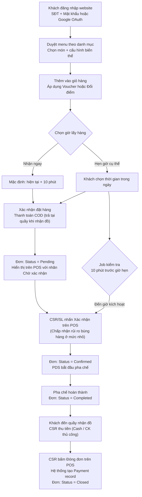
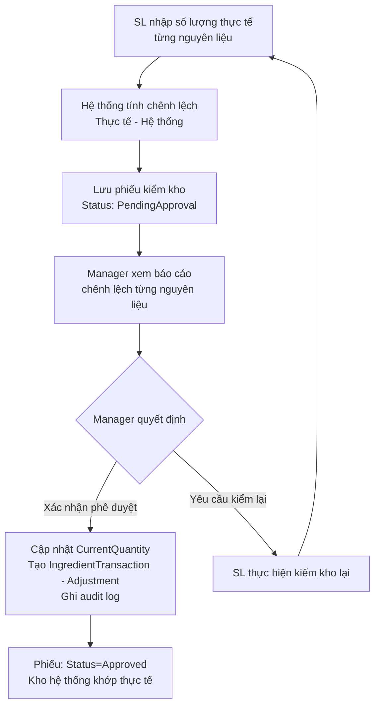
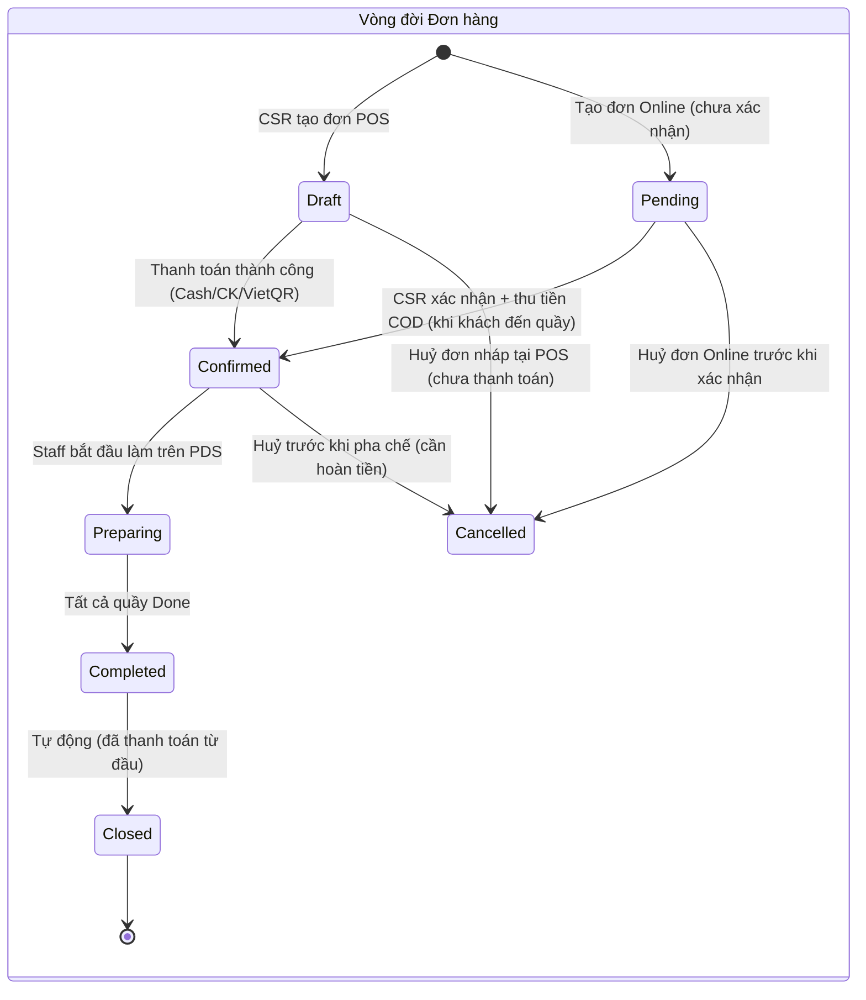
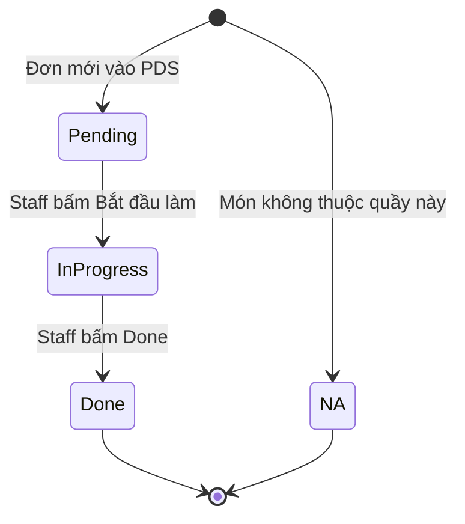
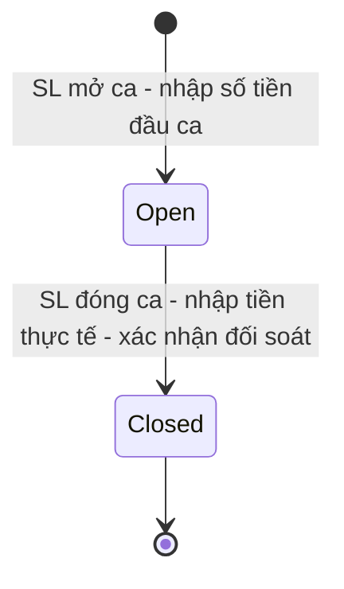
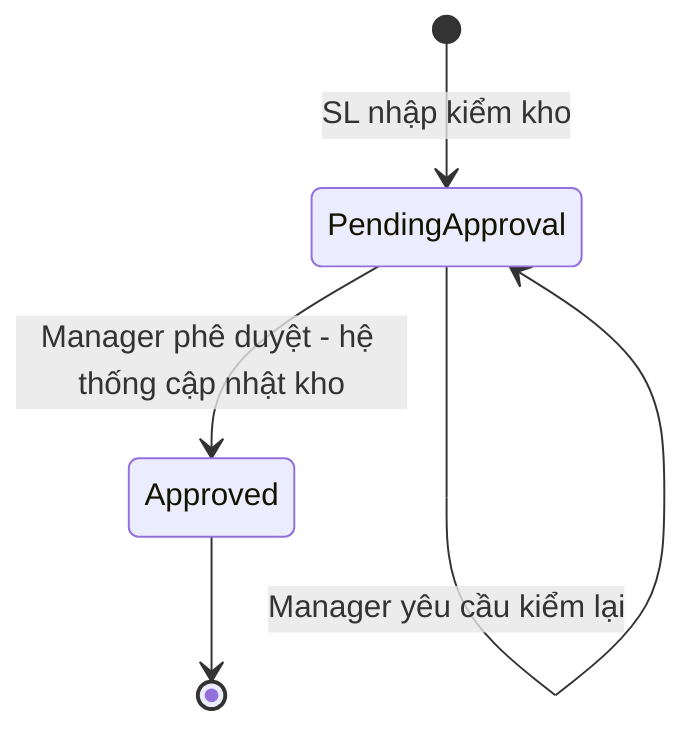

# TÀI LIỆU ĐẶC TẢ YÊU CẦU PHẦN MỀM (SRS) — CafePOS
## Hệ thống Quản lý Bán hàng Quán Cà phê / Trà sữa

| Thuộc tính | Giá trị |
|-----------|---------|
| **Tên hệ thống** | CafePOS |
| **Phiên bản SRS** | 1.2 |
| **Ngày tạo** | 17/06/2026 |
| **Ngày cập nhật** | 22/06/2026 |
| **Trạng thái** | Cập nhật kiến trúc — Chuyển sang mô hình **Thanh toán trước (Pay-First)** |
| **Nền tảng** | Web (ASP.NET Core 8 + SQL Server) |
| **Kiến trúc** | API-first (RESTful + SignalR) |

---

## MỤC LỤC

1. [Giới thiệu](#phần-1-giới-thiệu)
   - 1.1 Mục đích
   - 1.2 Tổng quan ứng dụng
   - 1.3 Đối tượng đọc
   - 1.4 Chữ viết tắt
   - 1.5 Tài liệu tham khảo
   - 1.6 Phạm vi hệ thống (Scope)
2. [Yêu cầu mức tổng thể](#phần-2-yêu-cầu-mức-tổng-thể)
3. [Yêu cầu bảo mật & Phân quyền](#phần-3-yêu-cầu-bảo-mật--phân-quyền)
4. [Đặc tả Use Case](#phần-4-đặc-tả-use-case)
5. [Thiết kế màn hình](#phần-5-thiết-kế-màn-hình)
6. [Yêu cầu khác](#phần-6-các-yêu-cầu-khác)
7. [Phụ lục C — Traceability Matrix](#phụ-lục-c-traceability-matrix)
8. [Phụ lục D — FR/NFR đánh số](#phụ-lục-d-frnfr-đánh-số)
9. [Phụ lục E — User Stories](#phụ-lục-e-user-stories)

---

## PHẦN 1: GIỚI THIỆU (INTRODUCTION)

### 1.1 Mục đích (Purpose)

Tài liệu Đặc tả Yêu cầu Phần mềm (SRS) này xác định chi tiết, đầy đủ và có hệ thống các yêu cầu chức năng và phi chức năng của hệ thống quản lý và bán hàng **CafePOS** dành cho quán cà phê / trà sữa. Tài liệu này là cơ sở cốt lõi giúp các bộ phận Phát triển (Dev), Kiểm thử (QA/QC), Quản trị dự án (PM/PO) và Stakeholder thống nhất về phạm vi tính năng, kiến trúc dữ liệu và tiêu chuẩn vận hành của hệ thống.

Tài liệu được xây dựng dựa trên kết quả Stakeholder Interview thực hiện trong Sprint 0 (ngày 11/06/2026), đã được Stakeholder xác nhận và phê duyệt chính thức.

### 1.2 Tổng quan ứng dụng (Application Overview)

**CafePOS** là hệ thống quản lý vận hành chuyên sâu dành cho quán cà phê / trà sữa quy mô vừa và nhỏ, xây dựng trên nền tảng **Web** và vận hành **local** (có thể mở rộng lên Cloud sau này). Hệ thống số hóa toàn bộ quy trình từ tiếp nhận order, điều phối pha chế, thanh toán, quản lý khách hàng thân thiết, kiểm soát tồn kho nguyên liệu đến báo cáo vận hành theo ca và doanh thu chi tiết cho chủ quán.

**Mục đích chính:**
- Loại bỏ hoàn toàn quy trình viết tay và nhận order qua điện thoại, giảm thiểu tình trạng miss order
- Tối ưu hóa tốc độ truyền thông giữa quầy thu ngân → quầy Bar → quầy Đồ ăn nhẹ
- Cung cấp báo cáo doanh thu tức thời và theo lịch sử để ra quyết định kinh doanh
- Xây dựng chương trình khách hàng thân thiết (loyalty) và khuyến mãi linh hoạt
- Chuẩn bị kiến trúc API-first để dễ dàng mở rộng sang ứng dụng mobile trong tương lai

**Các phân hệ cốt lõi:**

| Phân hệ | Mô tả | Đối tượng sử dụng |
|---------|-------|------------------|
| **POS (Point of Sale)** | Đặt hàng, thanh toán, quản lý ca | Cashier, Shift Leader |
| **PDS (Production Display Screen)** | Hiển thị đơn hàng real-time cho pha chế | Barista, Pastry Staff |
| **Online Ordering Website** | Đặt hàng trực tuyến, theo dõi đơn | Khách hàng |
| **Admin Dashboard** | Quản lý menu, nhân viên, báo cáo, khuyến mãi | Owner/Manager |
| **Shift Management** | Mở/đóng ca, đối soát két tiền | Shift Leader |

### 1.3 Đối tượng đọc tài liệu (Intended Audience)

- **Lập trình viên (Developers):** Sử dụng để phát triển database schema, APIs (ASP.NET Core), và giao diện Razor Pages
- **Đội ngũ kiểm thử (QA/QC):** Sử dụng các đặc tả nghiệp vụ và tiêu chí nghiệm thu để thiết lập Test Cases
- **Chủ quán / Stakeholder:** Sử dụng để nắm rõ luồng vận hành và làm căn cứ nghiệm thu bàn giao
- **BA / PM:** Tài liệu gốc để quản lý phạm vi và theo dõi tiến độ Sprint

### 1.4 Chữ viết tắt (Abbreviations)

| Viết tắt | Giải nghĩa |
|---------|-----------|
| **SRS** | Software Requirements Specification — Đặc tả Yêu cầu Phần mềm |
| **POS** | Point of Sale — Điểm bán hàng |
| **PDS** | Production Display Screen — Màn hình hiển thị pha chế |
| **RBAC** | Role-Based Access Control — Kiểm soát truy cập theo vai trò |
| **JWT** | JSON Web Token — Cơ chế xác thực không trạng thái |
| **CSR** | Cashier — Thu ngân |
| **SL** | Shift Leader — Trưởng ca |
| **API** | Application Programming Interface |
| **ERD** | Entity Relationship Diagram — Sơ đồ quan hệ thực thể |
| **BRD** | Business Requirements Document — Tài liệu yêu cầu nghiệp vụ |
| **COD** | Cash On Delivery — Thanh toán khi nhận hàng |
| **OAuth** | Open Authorization — Giao thức xác thực mở (Google) |
| **SignalR** | Thư viện real-time của ASP.NET Core (WebSocket) |
| **BOM** | Bill of Materials — Công thức nguyên liệu (Recipe) |
| **AC** | Acceptance Criteria — Tiêu chí nghiệm thu |
| **RTO** | Recovery Time Objective — Thời gian khôi phục mục tiêu |
| **FR** | Functional Requirement — Yêu cầu chức năng |
| **NFR** | Non-Functional Requirement — Yêu cầu phi chức năng |
| **US** | User Story — Câu chuyện người dùng |

### 1.5 Tài liệu tham khảo (References)

| Tài liệu | Phiên bản | Ngày |
|---------|----------|------|
| `brd.md` — Business Requirements Document | v1.3 | 22/06/2026 |
| `erd.md` — Entity Relationship Diagram | v1.2 | 22/06/2026 |
| `api_contract.md` — API Contract | v1.2 | 22/06/2026 |
| `wireframes.md` — Wireframes | v1.2 | 22/06/2026 |
| Kết quả Stakeholder Interview Sprint 0 | — | 11/06/2026 |

---

### 1.6 Phạm vi hệ thống (Scope)

#### Trong phạm vi (In Scope)

Các phân hệ và tính năng sau **được đưa vào phạm vi** phát triển của CafePOS v1.x:

| Phân hệ | Tính năng chính |
|--------|-----------------|
| **POS Bán hàng** | Tạo đơn Dine-in/Take-away, chọn món + biến thể, **thanh toán trước**, đẩy PDS |
| **PDS Pha chế** | Màn hình real-time Bar/Pastry, đánh dấu Done, SignalR notification |
| **Online Ordering** | Đặt hàng qua website, hẹn giờ, COD, theo dõi trạng thái real-time |
| **Chương trình Loyalty** | Tích điểm, đổi điểm, phân hạng Silver/Gold, reset định kỳ |
| **Khuyến mãi (Voucher)** | Tạo/quản lý voucher, validate khi dùng, báo cáo hiệu quả |
| **Quản lý Tồn kho** | Nhập kho, kiểm kho 2 bước, cảnh báo ngưỡng, BOM nguyên liệu |
| **Báo cáo vận hành** | Doanh thu theo ngày/tuần/tháng/giờ, sản phẩm bán chạy, tồn kho |
| **Quản lý Ca (Shift)** | Mở/đóng ca, đối soát két tiền, báo cáo tổng kết ca |
| **Admin Dashboard** | CRUD menu, nhân viên, khuyến mãi, cấu hình hệ thống |
| **Audit Log** | Ghi nhật ký các thao tác nhạy cảm vào bảng `AuditLogs` |

#### Ngoài phạm vi (Out of Scope)

Các tính năng sau **không được phát triển** trong phiên bản hiện tại. Việc xác định rõ giúp tránh scope creep trong quá trình phát triển:

| Tính năng | Lý do loại trừ |
|----------|-----------------|
| **Giao hàng tận nơi (Delivery)** | Cần tích hợp bên thứ ba phức tạp, không phù hợp quy mô nhỏ |
| **Tích hợp GrabFood / ShopeeFood** | Ngoài phạm vi đồ án, có thể mở rộng sau |
| **Thanh toán điện tử (MoMo/VNPay/ZaloPay)** | Chỉ hỗ trợ Cash + Chuyển khoản thủ công |
| **In hoá đơn nhiệt (Thermal Printer)** | Tích hợp phần cứng, xem xét giai đoạn sau |
| **Quản lý Lương nhân viên** | Phần mềm kế toán chuyên dụng đảm nhiệm |
| **Quản lý Nhà cung cấp (Supplier)** | Ngoài phạm vi vận hành POS |
| **Phần mềm Kế toán / Sổ sách** | Tích hợp với phần mềm kế toán riêng nếu cần |
| **Ứng dụng Mobile (iOS/Android)** | API-first đã sẵn sàng, mobile app phát triển giai đoạn sau |
| **Đa chi nhánh (Multi-branch)** | Kiến trúc đơn lẻ — single-store trong v1.x |
| **Camera / Nhận diện khuôn mặt** | Ngoài phạm vi |
| **Quản lý Sơ đồ / Trạng thái Bàn** | Mô hình **Pay-First** — khách vào, chọn món, thanh toán ngay. Nhân viên tự sắp bàn. Hệ thống không cần lưu trạng thái bàn (giống Highlands, Gong Cha, Starbucks) |

> **Tại sao cần mục này?** Scope rõ ràng giúp Dev Team tập trung đúng mục tiêu, QA không test những tính năng chưa được yêu cầu, và Stakeholder không kỳ vọng sai về phạm vi bàn giao.

---

## PHẦN 2: YÊU CẦU MỨC TỔNG THỂ (HIGH LEVEL REQUIREMENT)

### 2.1 Biểu đồ quan hệ đối tượng (Entity Relationship Diagram)

Biểu đồ mô tả cấu trúc dữ liệu gồm **23 thực thể** chính của hệ thống CafePOS, phân thành 6 nhóm chức năng: Identity & Staff, Menu & Products, Orders & Payments, Loyalty & Voucher, Shift & Inventory, System (AuditLogs).

> **Thay đổi so với v1.1:** Chuyển sang mô hình **Pay-First** — Thêm entity `Payments`, xóa entity `Tables`, đơn giản hóa `Orders` (bỏ `TableNumber`, `AmountReceived`, `AmountChange`). `PaymentStatus` không còn cần theo dõi trong Orders vì tiền luôn thu người.

```mermaid
erDiagram
    Staffs {
        int Id PK
        string FullName
        string Phone
        string Email
        string PosCode "Mã đăng nhập POS - bcrypt hashed"
        string PasswordHash "Cho Admin Dashboard"
        string Role "Owner|ShiftLeader|Cashier|Barista|PastryStaff"
        decimal BaseSalary
        string Status "Active|Inactive"
        datetime CreatedAt
    }
    Customers {
        int Id PK
        string FullName
        string Phone
        string Email
        string GoogleId "Null nếu đăng ký bằng SĐT"
        string PasswordHash
        decimal TotalSpend "Cộng dồn vĩnh viễn - tính tier"
        string LoyaltyTier "None|Silver|Gold"
        int CurrentPoints "Reset mỗi 2 tháng"
        datetime PointsResetAt
        datetime CreatedAt
    }
    Categories {
        int Id PK
        string Name
        string DisplayStation "Bar|Pastry|Both"
        int DisplayOrder
        bool IsActive
    }
    Products {
        int Id PK
        int CategoryId FK
        string Name
        string Description
        string ImageUrl
        decimal BasePrice
        string Status "Active|Inactive|OutOfStock"
        bool HasSizeOption
        bool HasSugarOption
        bool HasIceOption
        datetime CreatedAt
    }
    ProductSizes {
        int Id PK
        int ProductId FK
        string SizeLabel "S|M|L"
        decimal PriceModifier
        bool IsDefault
    }
    Toppings {
        int Id PK
        string Name
        decimal Price
        bool IsActive
        datetime CreatedAt
    }
    Orders {
        int Id PK
        string OrderCode "CF-YYMMDD-SEQ"
        string Type "DineIn|TakeAway|Online"
        int CustomerId FK
        int StaffId FK
        string CustomerName
        string CustomerPhone
        string Status "Draft|Pending|Confirmed|Preparing|Completed|Closed|Cancelled"
        decimal SubTotal
        decimal DiscountAmount
        decimal TotalAmount
        datetime ScheduledPickupTime "Chỉ dùng Online"
        datetime ConfirmedAt
        datetime CompletedAt
        datetime ClosedAt
        byte[] RowVersion "EF Core Concurrency Token"
        datetime CreatedAt
    }
    Payments {
        int Id PK
        int OrderId FK
        string Method "Cash|Transfer|Mixed"
        decimal Amount "Số tiền đã thu"
        decimal AmountReceived "Số tiền khách đưa (Cash)"
        decimal AmountChange "Tiền thối lại (Cash)"
        string ReferenceCode "Mã đối chiếu chuyển khoản / Mã đơn hàng đối với VietQR"
        int CreatedByStaffId FK
        datetime PaidAt
    }
    OrderItems {
        int Id PK
        int OrderId FK
        int ProductId FK
        int Quantity
        decimal UnitPrice "Giá tại thời điểm đặt"
        decimal ItemTotal
        string Notes
        string SizeLabel "S|M|L"
        string SugarLevel "0|30|50|70|Extra"
        string IceLevel "0|50|100"
        bool IsPointRedemption "true = giá 0đ"
        string BarStatus "NA|Pending|InProgress|Done"
        string PastryStatus "NA|Pending|InProgress|Done"
    }
    OrderItemToppings {
        int Id PK
        int OrderItemId FK
        int ToppingId FK
        decimal ToppingPrice "Giá topping tại thời điểm đặt"
    }
    OrderDiscounts {
        int Id PK
        int OrderId FK
        string DiscountType "Loyalty|Voucher|Manual"
        decimal DiscountValue
        string DiscountDescription
        int VoucherId FK
        int ApprovedByStaffId FK
        datetime ApprovedAt
    }
    LoyaltyTierConfigs {
        int Id PK
        string TierName
        decimal MinSpendThreshold
        decimal DiscountPercent
        bool IsActive
    }
    Vouchers {
        int Id PK
        string Code
        string DiscountType "Percent|Fixed"
        decimal DiscountValue
        decimal MinOrderValue
        int MaxUsageCount "Null = không giới hạn"
        int UsedCount
        bool IsPermanent
        datetime ExpiresAt
        bool IsActive
        int CreatedByStaffId FK
        datetime CreatedAt
    }
    VoucherUsages {
        int Id PK
        int VoucherId FK
        int OrderId FK
        int CustomerId FK
        datetime UsedAt
    }
    PointProducts {
        int Id PK
        string Name
        int PointCost
        int LinkedProductId FK
        bool IsActive
        datetime CreatedAt
    }
    PointTransactions {
        int Id PK
        int CustomerId FK
        int OrderId FK
        string TransactionType "Earn|Redeem|Reset"
        int Points
        string Description
        datetime CreatedAt
    }
    Shifts {
        int Id PK
        datetime ShiftDate
        int OpenedByStaffId FK
        int ClosedByStaffId FK
        datetime OpenedAt
        datetime ClosedAt
        decimal OpeningCash
        decimal ExpectedCash
        decimal ExpectedTransfer
        decimal ActualCash
        decimal ActualTransfer
        decimal CashDifference
        decimal TransferDifference
        string Notes
        string Status "Open|Closed"
    }
    Ingredients {
        int Id PK
        string Name
        string Unit "kg|lít|gói|hộp"
        decimal CurrentQuantity
        decimal MinAlertQuantity
        int ExpiryAlertDays
        datetime ExpiresAt
        bool IsActive
        datetime CreatedAt
    }
    InventoryChecks {
        int Id PK
        int ShiftId FK
        int StaffId FK
        datetime CheckedAt
        string Status "PendingApproval|Approved"
        int ApprovedByStaffId FK
        datetime ApprovedAt
        string Notes
    }
    InventoryCheckItems {
        int Id PK
        int InventoryCheckId FK
        int IngredientId FK
        decimal SystemQuantity
        decimal ActualQuantity
        decimal Difference
    }
    IngredientTransactions {
        int Id PK
        int IngredientId FK
        string TransactionType "StockIn|SaleDeduct|Adjustment"
        decimal Quantity
        int RelatedOrderId FK
        int CreatedByStaffId FK
        string Notes
        datetime CreatedAt
    }
    ProductIngredients {
        int Id PK
        int ProductId FK "Sản phẩm cần nguyên liệu"
        int IngredientId FK "Nguyên liệu cần dùng"
        decimal Quantity "Số lượng sử dụng cho 1 đơn vị sản phẩm"
        string Unit "g|ml|cái"
    }
    AuditLogs {
        int Id PK
        int StaffId FK "Null nếu là hành động của hệ thống"
        string Action "CREATE|UPDATE|DELETE|APPROVE|CANCEL|REFUND"
        string EntityName "Orders|Staffs|Ingredients|Shifts..."
        int EntityId "ID của bản ghi bị ảnh hưởng"
        string OldValue "JSON snapshot trước khi thay đổi"
        string NewValue "JSON snapshot sau khi thay đổi"
        string IPAddress
        datetime CreatedAt
    }

    Categories ||--o{ Products : "có"
    Products ||--o{ ProductSizes : "có"
    Orders ||--o{ OrderItems : "chứa"
    Orders }o--o| Customers : "đặt bởi"
    Orders }o--|| Staffs : "tạo bởi"
    Orders ||--o{ Payments : "thanh toán qua"
    Payments }o--|| Staffs : "thực hiện bởi"
    OrderItems }o--|| Products : "tham chiếu"
    OrderItems ||--o{ OrderItemToppings : "có"
    OrderItemToppings }o--|| Toppings : "là"
    Orders ||--o{ OrderDiscounts : "có"
    OrderDiscounts }o--o| Vouchers : "dùng"
    OrderDiscounts }o--o| Staffs : "xác nhận bởi"
    PointTransactions }o--|| Customers : "thuộc về"
    PointTransactions }o--o| Orders : "từ đơn"
    PointProducts }o--|| Products : "đổi thành"
    VoucherUsages }o--|| Vouchers : "dùng"
    VoucherUsages }o--o| Orders : "trong đơn"
    VoucherUsages }o--o| Customers : "bởi khách"
    Vouchers }o--|| Staffs : "tạo bởi"
    Shifts }o--|| Staffs : "mở bởi"
    Shifts }o--o| Staffs : "đóng bởi"
    InventoryChecks }o--|| Shifts : "trong ca"
    InventoryChecks }o--|| Staffs : "thực hiện bởi"
    InventoryChecks ||--o{ InventoryCheckItems : "chứa"
    InventoryCheckItems }o--|| Ingredients : "kiểm tra"
    IngredientTransactions }o--|| Ingredients : "cho"
    IngredientTransactions }o--o| Orders : "từ"
    IngredientTransactions }o--o| Staffs : "bởi"
    Products ||--o{ ProductIngredients : "cần nguyên liệu"
    ProductIngredients }o--|| Ingredients : "là"
    AuditLogs }o--o| Staffs : "thực hiện bởi"

---

### 2.2 Biểu đồ luồng công việc (Workflow Diagram)

#### 2.2.1 Luồng bán hàng tại POS (Dine-in & Take-away) — Mô hình Pay-First

```mermaid
flowchart TD
    A["Khách hàng đến quán"] --> B{"Loại phục vụ?"}
    B -->|Tại chỗ - Dine-in| C["CSR chọn loại: Dine-in\nNhập SĐT khách (tuỳ chọn)"]
    B -->|Mang về - Take-away| D["CSR chọn loại: Take-away\nNhập SĐT khách (tuỳ chọn)"]
    C & D --> E["Hệ thống tạo đơn: Status = Draft\nCSR chọn món từ menu\nCấu hình: Size / Đường / Đá / Topping / Ghi chú"]
    E --> F["Áp dụng Voucher hoặc\nLoyalty Discount tự động theo tier"]
    F --> G{"Discount thủ công?"}
    G -->|Có| H["CSR nhập % giảm\nSL/Manager nhập mã POS xác nhận\nHệ thống ghi audit log"]
    G -->|Không| I["Hiển thị tất cả món + tổng tiền"]
    H --> I
    I --> J{"Phương thức thanh toán?"}
    J -->|Tiền mặt| K["CSR nhập tiền khách đưa\nHệ thống tính tiền thối"]
    J -->|Chuyển khoản thủ công| L["Khách chuyển khoản ngân hàng\nCSR check app và xác nhận"]
    J -->|VietQR| QR["Hệ thống tạo QR chứa tiền + nội dung OrderCode\nKhách quét QR và chuyển khoản\nCSR xác nhận thủ công"]
    J -->|Hỗn hợp| M["Nhập phần Cash + phần Transfer/VietQR"]
    K & L & QR & M --> N["Hệ thống tạo Payment record\nĐơn: Status = Confirmed\nSignalR đẩy đến PDS Bar + PDS Pastry"]
    N --> O["Barista/Pastry Staff xem đơn trên PDS\nBắt đầu làm - Done từng món"]
    O --> P{"Cả 2 quầy Done?"}
    P -->|Chưa| O
    P -->|Có| Q["Đơn: Completed → Tự động Closed\nCộng điểm + cập nhật TotalSpend khách"]
```

#### 2.2.2 Luồng đặt hàng Online (Customer Website) — COD Pay at Store



#### 2.2.3 Luồng Kiểm kho 2 bước



---

### 2.3 Biểu đồ chuyển đổi trạng thái (State Transition Diagram)

#### 2.3.1 Vòng đời Đơn hàng (Order Lifecycle) — Pay-First



> **Quy tắc đóng đơn:**
> - **Đơn POS (Pay-First):** Tự động đóng (`Status = Closed`, `ClosedAt = now()`) ngay khi pha chế xong (`Status = Completed`) vì tiền đã thu trước.
> - **Đơn Online (Pay-Later COD):** Được pha chế trước và chuyển sang `Status = Completed`. Khi khách đến nhận đồ, CSR thu tiền và bấm Đóng đơn trên POS → tạo `Payment` record và chuyển đơn sang `Closed`.
>
> **Trạng thái Draft và Pending:** Đơn POS bắt đầu từ `Draft` (chờ thanh toán để chuyển sang `Confirmed`). Đơn Online bắt đầu từ `Pending` (chờ CSR duyệt sang `Confirmed` để pha chế trước khi thu tiền).

#### 2.3.2 Trạng thái món trên PDS (OrderItem Station Status)



#### 2.3.3 Trạng thái Ca làm việc (Shift)



#### 2.3.4 Trạng thái Phiếu kiểm kho (InventoryCheck)



---

### 2.4 Biểu đồ Use Case (Use Case Diagram)

```mermaid
flowchart LR
    Customer((Khách hàng))
    Cashier((Thu ngân\nCSR))
    Barista((Barista))
    Pastry((Pastry\nStaff))
    ShiftLeader((Shift Leader\nSL))
    Manager((Manager\nOwner))

    subgraph POS["🖥️ POS — Bán hàng tại quầy"]
        direction LR
        UC01(["UC-01: Đăng nhập POS bằng mã code"])
        UC02(["UC-02: Tạo đơn Dine-in"])
        UC03(["UC-03: Tạo đơn Take-away"])
        UC04(["UC-04: Chọn món và cấu hình biến thể"])
        UC05(["UC-05: Gọi thêm món (Tạo đơn thứ 2)"])
        UC06(["UC-06: Áp dụng Voucher"])
        UC07(["UC-07: Áp dụng Loyalty Discount tự động"])
        UC08(["UC-08: Discount thủ công + xác nhận SL"])
        UC09(["UC-09: Thanh toán đơn hàng bằng VietQR"])
        UC10(["UC-10: Thanh toán tại POS (Cash / CK thủ công / Hỗn hợp)"])
        UC11(["UC-11: Xác nhận đơn hàng Online"])
        UC12(["UC-12: Sửa / Xoá món đơn Online chưa confirm"])
        UC13(["UC-13: Huỷ đơn hàng"])
        UC14(["UC-14: Xem lịch sử đơn trong ca"])
    end

    subgraph PDS["📺 PDS — Màn hình pha chế"]
        direction LR
        UC20(["UC-20: Xem danh sách đơn real-time"])
        UC21(["UC-21: Bắt đầu làm món"])
        UC22(["UC-22: Đánh dấu Done từng món"])
        UC23(["UC-23: Hoàn thành toàn bộ quầy"])
        UC24(["UC-24: Cấu hình chế độ hiển thị PDS"])
    end

    subgraph Online["🌐 Online Ordering — Website khách hàng"]
        direction LR
        UC30(["UC-30: Đăng ký tài khoản"])
        UC31(["UC-31: Đăng nhập SĐT hoặc Google"])
        UC32(["UC-32: Duyệt menu và thêm vào giỏ"])
        UC33(["UC-33: Chọn giờ lấy hàng"])
        UC34(["UC-34: Áp dụng Voucher / Đổi điểm"])
        UC35(["UC-35: Đặt hàng online - Thanh toán COD"])
        UC36(["UC-36: Theo dõi trạng thái đơn real-time"])
        UC37(["UC-37: Xem lịch sử đơn hàng"])
        UC38(["UC-38: Xem điểm thưởng và hạng thành viên"])
    end

    subgraph Shift["⏱️ Shift — Quản lý ca làm việc"]
        direction LR
        UC40(["UC-40: Mở ca - nhập tiền đầu ca"])
        UC41(["UC-41: Xem doanh thu tức thời trong ca"])
        UC42(["UC-42: Nhập kiểm kho thủ công"])
        UC43(["UC-43: Đóng ca - đối soát két tiền"])
        UC44(["UC-44: Xuất báo cáo tổng kết ca"])
    end

    subgraph Admin["⚙️ Admin Dashboard — Quản trị hệ thống"]
        direction LR
        UC50(["UC-50: Quản lý danh mục sản phẩm"])
        UC51(["UC-51: Quản lý sản phẩm và biến thể"])
        UC52(["UC-52: Quản lý Topping"])
        UC53(["UC-53: Cấu hình danh mục hiển thị PDS"])
        UC54(["UC-54: Quản lý nhân viên và mã POS"])
        UC55(["UC-55: Quản lý Voucher / Coupon"])
        UC56(["UC-56: Cấu hình chương trình Loyalty"])
        UC57(["UC-57: Quản lý sản phẩm đổi điểm"])
        UC58(["UC-58: Quản lý nguyên liệu tồn kho"])
        UC59(["UC-59: Duyệt phiếu kiểm kho - 2 bước"])
        UC60(["UC-60: Báo cáo doanh thu theo ngày/tuần/tháng"])
        UC61(["UC-61: Báo cáo doanh thu theo khung giờ"])
        UC62(["UC-62: Báo cáo sản phẩm bán chạy / bán ít"])
        UC63(["UC-63: Báo cáo Voucher"])
        UC64(["UC-64: Báo cáo Loyalty và điểm khách"])
        UC65(["UC-65: Báo cáo tồn kho và cảnh báo"])
    end

    Cashier     --> POS
    ShiftLeader --> POS
    ShiftLeader --> Shift
    Barista     --> PDS
    Pastry      --> PDS
    Manager     --> PDS
    Manager     --> Admin
    Customer    --> Online
```



---

## PHẦN 3: YÊU CẦU BẢO MẬT & PHÂN QUYỀN (SECURITY REQUIREMENT)

### 3.1 Cơ chế xác thực (Authentication Mechanisms)

| Phương thức | Áp dụng cho | Cơ chế kỹ thuật |
|------------|------------|----------------|
| **Mã code POS** | CSR, SL, Barista, Pastry | Nhập mã số (ví dụ: `2018000520`) → Validate bcrypt hash → JWT ngắn hạn (8h) |
| **Username + Password** | Owner, Manager | ASP.NET Identity → JWT (24h) + Refresh Token |
| **SĐT + Password** | Customer | Custom auth → JWT (7 ngày) |
| **Google OAuth 2.0** | Customer | OAuth 2.0 Authorization Code Flow → JWT |
| **Mã xác nhận discount** | SL, Manager | Nhập lại POS code → Validate role tại thời điểm thao tác |

### 3.2 Ma trận phân quyền (RBAC Matrix)

| Chức năng | Owner / Manager | Shift Leader | Cashier | Barista | Pastry Staff | Customer |
|-----------|:--------------:|:------------:|:-------:|:-------:|:------------:|:--------:|
| **POS — Bán hàng** | | | | | | |
| Tạo đơn Dine-in / Take-away | ✅ | ✅ | ✅ | — | — | — |
| Chọn món + cấu hình biến thể | ✅ | ✅ | ✅ | — | — | — |
| Gọi thêm món (tạo đơn thứ 2) | ✅ | ✅ | ✅ | — | — | — |
| Áp dụng Voucher | ✅ | ✅ | ✅ | — | — | — |
| Áp dụng Loyalty Discount | ✅ | ✅ | ✅ | — | — | — |
| Nhập % Discount thủ công | ✅ | ✅ | ✅ nhập | — | — | — |
| **Xác nhận discount thủ công** | ✅ code | ✅ code | ❌ | — | — | — |
| Thanh toán Cash / CK / VietQR | ✅ | ✅ | ✅ | — | — | — |
| Xác nhận đơn hàng Online | ✅ | ✅ | ✅ | — | — | — |
| Sửa / Xoá món đơn Online | ✅ | ✅ | ✅ | — | — | — |
| Huỷ đơn hàng | ✅ | ✅ | ✅ | — | — | — |
| **PDS — Pha chế** | | | | | | |
| Xem PDS Bar | — | — | — | ✅ | — | — |
| Xem PDS Pastry | — | — | — | — | ✅ | — |
| Đánh dấu Done món | — | — | — | ✅ | ✅ | — |
| Hoàn thành quầy | — | — | — | ✅ | ✅ | — |
| Cấu hình chế độ hiển thị PDS | ✅ | — | — | — | — | — |
| **Ca làm việc** | | | | | | |
| Mở ca (nhập tiền đầu ca) | ✅ | ✅ | — | — | — | — |
| Xem doanh thu tức thời | ✅ | ✅ | — | — | — | — |
| Nhập kiểm kho (Bước 1) | ✅ | ✅ | — | — | — | — |
| Đóng ca (đối soát két tiền) | ✅ | ✅ | — | — | — | — |
| Xuất báo cáo ca | ✅ | ✅ | — | — | — | — |
| **Admin Dashboard** | | | | | | |
| Quản lý Menu — CRUD | ✅ | — | — | — | — | — |
| Cấu hình PDS theo danh mục | ✅ | — | — | — | — | — |
| Quản lý Nhân viên — CRUD | ✅ | — | — | — | — | — |
| Quản lý Voucher — CRUD | ✅ | — | — | — | — | — |
| Cấu hình Loyalty | ✅ | — | — | — | — | — |
| Quản lý Tồn kho — CRUD | ✅ | — | — | — | — | — |
| **Duyệt phiếu kiểm kho (Bước 2)** | ✅ | — | — | — | — | — |
| Báo cáo đầy đủ | ✅ | Giới hạn ca | — | — | — | — |
| **Online Ordering** | | | | | | |
| Duyệt menu, đặt hàng online | — | — | — | — | — | ✅ |
| Xem lịch sử đơn | — | — | — | — | — | ✅ |
| Xem / dùng điểm thưởng | — | — | — | — | — | ✅ |

> **Ghi chú ký hiệu:** ✅ = Có quyền | ❌ = Bị từ chối | — = Không áp dụng

### 3.3 Bảo mật dữ liệu nhạy cảm

| Dữ liệu | Phương thức bảo vệ |
|--------|------------------|
| POS Code của Staff | bcrypt hash, không lưu plaintext |
| Password Staff/Customer | ASP.NET Identity PasswordHasher (PBKDF2) |
| JWT Token | HS256 signed, có expiry ngắn |
| Thông tin khách hàng | Không log SĐT/email trong error log |

### 3.4 Audit Log bắt buộc

> **Thực hiện kỹ thuật:** Tất cả các thao tác dưới đây phải được lưu vào bảng **`AuditLogs`** (xem ERD mục 2.1). Không chỉ log vào file text, mà phải lưu cấu trúc để có thể query, lọc và xuất báo cáo.

| Thao tác | EntityName | Action | Trường ghi lại |
|---------|-----------|--------|--------------------|
| Áp dụng discount thủ công | `Orders` | `UPDATE` | StaffId CSR, StaffId approver, % discount, OrderId, OldValue/NewValue |
| Mở ca | `Shifts` | `CREATE` | StaffId SL, OpeningCash, timestamp |
| Đóng ca | `Shifts` | `UPDATE` | StaffId SL, ActualCash, ActualTransfer, CashDifference, OldValue/NewValue |
| Huỷ đơn hàng | `Orders` | `CANCEL` | StaffId, OrderId, Reason, OldStatus |
| Xoá / Đổi món đơn Online | `OrderItems` | `DELETE/UPDATE` | StaffId, OrderId, ItemId, OldValue/NewValue |
| Duyệt phiếu kiểm kho | `InventoryChecks` | `APPROVE` | ManagerId, CheckId, số nguyên liệu điều chỉnh |
| Hoàn tiền (đơn đã đóng) | `Orders` | `REFUND` | StaffId, OrderId, RefundAmount, phương thức hoàn |
| Xóa/sửa thông tin nhân viên | `Staffs` | `UPDATE/DELETE` | ManagerId, OldValue/NewValue |

### 3.5 Yêu cầu bảo mật nâng cao (Advanced Security Requirements)

#### 3.5.1 Rate Limiting

| Endpoint | Giới hạn | Hành động khi vi phạm |
|---------|---------|------------------------|
| `POST /auth/*/login` | 5 lần/phút/IP | Khóa 5 phút, trả HTTP 429 |
| `POST /auth/*/login` (sai mã) | 3 lần liên tiếp | Khóa tài khoản tạm thời 15 phút |
| API chung (authenticated) | 200 req/phút/user | HTTP 429 + Retry-After header |
| `POST /orders` (tạo đơn) | 30 req/phút/user | Giới hạn abuse |

#### 3.5.2 Chính sách Mật khẩu (Password Policy)

| Đối tượng | Yêu cầu độ mạnh | Ghi chú |
|-----------|-----------|--------|
| **Staff (Admin/Manager)** | ≥ 8 ký tự, ≥ 1 số, ≥ 1 chữ hoa, ≥ 1 ký tự đặc biệt | Dùng cho Dashboard login |
| **Customer** | ≥ 8 ký tự, ≥ 1 số | Mật khẩu Website |
| **POS Code (Nhân viên)** | 4–10 chữ số | Mã số thuận tiện nhập nhanh |  

#### 3.5.3 Session Timeout

| Phân hệ | Loại Token | Thời hạn |
|---------|----------|----------|
| POS (Staff) | JWT Access Token | 8 giờ |
| Admin Dashboard (Manager/Owner) | JWT Access Token | 24 giờ + Refresh Token 30 ngày |
| Customer Website | JWT Access Token | 7 ngày |
| POS Code (Barista/Pastry) | JWT Access Token | 8 giờ (theo ca) |

> **Lưu ý:** Khi JWT hết hạn trong lvúc staff đang dùng POS, hệ thống phải hiển thị dialog xác nhận lại mà không mất dữ liệu đơn đang làm dở.

---

## PHẦN 4: ĐẶC TẢ USE CASE (USE CASE SPECIFICATION)

### UC-02: Tạo đơn Dine-in tại POS — Pay-First

- **Actor:** Thu ngân (Cashier), Shift Leader
- **Pre-conditions:** Người dùng đã đăng nhập POS. Ca làm việc ở trạng thái `Open`.
- **Normal Flow:**
  1. CSR nhấn nút **"+ Đơn mới"** trên màn hình POS chính.
  2. Hệ thống hiển thị popup chọn loại đơn: **Tại chỗ (Dine-in)** / **Mang về (Take-away)**.
  3. CSR chọn **Tại chỗ**.
  4. CSR nhập SĐT khách (tuỳ chọn) → Hệ thống tra cứu và hiển thị tier loyalty (Silver/Gold) nếu có.
  5. Màn hình chọn món mở ra với sidebar danh mục (Tất cả | Trà Sữa | Cà Phê | Đồ Ăn Nhẹ...).
  6. CSR chọn sản phẩm từ grid → Popup cấu hình biến thể xuất hiện:
     - Size: S / M / L (giá tự cộng theo PriceModifier)
     - Đường: 0% / 30% / 50% / 70% / Thêm đường
     - Đá: Không đá / 50% / 100%
     - Topping: Danh sách checkbox kèm giá từng loại
     - Số lượng: Stepper (−/+)
     - Ghi chú: Text input tự do
  7. CSR nhấn **"Thêm vào đơn"**. Món xuất hiện trong giỏ hàng bên phải.
  8. Lặp lại bước 6–7 cho các món tiếp theo.
  9. CSR áp dụng voucher hoặc discount loyalty (tuỳ chọn). Hệ thống recalculate tổng tiền real-time.
  10. CSR nhấn **"Thanh toán"** → Màn hình thanh toán hiển thị tổng tiền cần thu.
  11. CSR chọn phương thức: **Tiền mặt** / **Chuyển khoản** / **Hỗn hợp**.
  12. CSR nhập thông tin thanh toán (số tiền nhận / mã CK) → nhấn **"Xác nhận Thu tiền"**.
  13. Hệ thống:
      - Tạo `Payment` record (Method, Amount, PaidAt, CreatedByStaffId)
      - Tạo `Order` với `Status = Confirmed`
      - Sinh `OrderCode` theo format `CF{YYMMDD}{SEQ:4}`
      - Ghi `OrderItems` với `UnitPrice` tại thời điểm đặt
      - Phát sự kiện `OrderCreated` qua SignalR đến PDS Bar và PDS Pastry
  14. Màn hình POS hiển thị tiền thối (nếu tiền mặt) và quay về danh sách đơn.
- **Alternate Flow — Gọi thêm món (khách muốn đơn thứ 2):**
  1. Khách đã thanh toán đơn gốc và muốn gọi thêm.
  2. CSR nhấn **"+ Đơn mới"**, chọn đúng loại (DineIn/TakeAway), gọi thêm món.
  3. Hệ thống tạo đơn mới độc lập `CF2406110002`.
  4. Thanh toán độc lập cho đơn mới.
- **Post-conditions:** `Payment` được ghi. Đơn `Status = Confirmed`. PDS nhận thông tin món real-time trong < 1 giây.
- **Exception Flow:**
  - Sản phẩm `OutOfStock` → Badge "Hết hàng", nút thêm bị disabled.
  - Nhập tiền nhận < tổng tiền (tiền mặt) → Hệ thống báo "Tiền không đủ".
  - Ca chưa mở → Khóa POS, hiển thị "Vui lòng mở ca trước".
- **Acceptance Criteria (AC):**
  - AC-02.1: Payment được ghi và đơn được Confirmed trong < 2 giây kể từ khi CSR nhấn "Xác nhận Thu tiền".
  - AC-02.2: PDS Bar và PDS Pastry nhận đơn mới qua SignalR trong < 1 giây **sau khi thanh toán**.
  - AC-02.3: Sản phẩm `OutOfStock` không thể được thêm vào đơn (nút bị disabled).
  - AC-02.4: `OrderCode` được sinh đúng format `CF{YYMMDD}{SEQ:4}`, không trùng lặp trong ngày.
  - AC-02.5: Nếu khách có tier Silver/Gold, discount loyalty hiển thị tự động khi nhập SĐT.
  - AC-02.6: Ca phải ở trạng thái `Open` thì mới tạo đơn được — nếu chưa mở ca, POS khóa.
  - AC-02.7: Không có field nhập số bàn trên màn hình POS.

---

### UC-08: Discount thủ công với xác nhận SL/Manager

- **Actor:** Thu ngân (CSR) — khởi tạo; Shift Leader / Manager — xác nhận bằng mã
- **Pre-conditions:** CSR đang ở màn hình chọn món / thanh toán, chưa nhấn Xác nhận Thu tiền.
- **Normal Flow:**
  1. CSR nhấn biểu tượng **"Giảm giá thêm"** trên màn hình thanh toán.
  2. Dialog nhập giảm giá thủ công xuất hiện:
     - Input số: `% giảm giá` (giá trị từ 1 đến 100)
     - Preview real-time: "Giảm X.000đ — Còn lại Y.000đ"
  3. CSR nhập mức giảm và nhấn **"Tiếp tục"**.
  4. Hệ thống chuyển sang màn hình xác nhận: **"Nhờ SL hoặc Quản lý nhập mã xác nhận"**.
  5. SL/Manager tiếp cận máy POS, nhập **mã code POS cá nhân** của họ.
  6. Hệ thống validate:
     - Mã code hợp lệ (khớp bcrypt hash)
     - Role của người nhập ≥ `ShiftLeader`
  7. Nếu hợp lệ:
     - Tạo `OrderDiscount` với `DiscountType = Manual`, `ApprovedByStaffId`, `ApprovedAt = now()`
     - Ghi audit log đầy đủ
  8. Màn hình thanh toán cập nhật tổng tiền mới. Hiển thị nhãn "Giảm giá đặc biệt: X%".
- **Post-conditions:** Discount được áp dụng. Audit trail đầy đủ trong `OrderDiscounts`.
- **Exception Flow:**
  - Mã code không hợp lệ → Thông báo lỗi "Mã không đúng", cho nhập lại (tối đa 3 lần).
  - Nhập mã của Cashier (role không đủ) → Hệ thống từ chối, hiển thị "Không đủ quyền".
- **Acceptance Criteria (AC):**
  - AC-08.1: Discount thủ công chỉ được áp dụng sau khi có mã xác nhận hợp lệ của SL/Manager.
  - AC-08.2: Mã Cashier bị từ chối ngay cả khi nhập đúng.
  - AC-08.3: Audit log ghi đủ StaffId CSR, StaffId approver, % discount, OrderId vào bảng `AuditLogs`.
  - AC-08.4: Sau 3 lần sai liên tiếp, dialog bị khóa và hệ thống thông báo liên hệ quản lý.
  - AC-08.5: Tổng tiền trên màn hình thanh toán cập nhật ngay sau khi xác nhận.

---

### UC-09: Thanh toán đơn hàng bằng VietQR

- **Actor:** Thu ngân (Cashier) — Primary; Khách hàng (Customer) — Secondary
- **Pre-conditions:**
  - Đơn hàng đã được tạo và có trạng thái `Status = Draft`.
  - Đơn hàng có ít nhất một sản phẩm.
  - Tổng tiền đơn hàng (`TotalAmount`) đã được tính toán sau khi áp dụng các khuyến mãi/discount (nếu có).
- **Normal Flow:**
  1. CSR hoàn tất việc chọn món và cấu hình đơn hàng cho khách.
  2. Hệ thống tính toán tổng tiền cần thanh toán.
  3. CSR nhấn nút **"Thanh toán"** trên màn hình POS và chọn phương thức **"VietQR"**.
  4. Hệ thống sinh mã QR động (hoặc hiển thị QR tĩnh kèm thông tin động) chứa:
     - Số tài khoản nhận tiền của quán (được cấu hình trước).
     - Tên ngân hàng & Tên chủ tài khoản nhận.
     - Số tiền chuyển khoản đúng bằng `TotalAmount`.
     - Nội dung chuyển khoản chứa mã đơn hàng `OrderCode` (ví dụ: `CF2606220001`).
  5. Hệ thống hiển thị mã QR lên màn hình POS (và màn hình phụ hiển thị cho khách nếu có).
  6. Khách hàng sử dụng ứng dụng Ngân hàng hoặc ví điện tử quét mã QR trên màn hình.
  7. Ứng dụng ngân hàng tự động điền các thông tin chuyển khoản (tài khoản nhận, số tiền, nội dung `OrderCode`). Khách hàng xác nhận chuyển khoản.
  8. Hệ thống ngân hàng thực hiện giao dịch chuyển khoản thành công.
  9. Tiền được chuyển vào tài khoản ngân hàng của quán.
  10. CSR kiểm tra điện thoại của quán (app ngân hàng hiển thị biến động số dư hoặc nhận tin nhắn SMS báo có).
  11. Sau khi xác nhận tiền đã về tài khoản, CSR nhấn nút **"Xác nhận đã nhận tiền"** trên màn hình POS.
  12. Hệ thống:
      - Tạo bản ghi `Payment` với thông tin: `OrderId` liên kết, `Method = "Transfer"`, `Amount = TotalAmount`, `ReferenceCode = OrderCode` (đối chiếu mã đơn hàng phục vụ đối soát), `PaidAt = DateTime.UtcNow`, `CreatedByStaffId = StaffId` của CSR.
      - Cập nhật đơn hàng sang trạng thái `Status = Confirmed`, ghi nhận `ConfirmedAt = DateTime.UtcNow`.
      - Phát sự kiện `OrderCreated` qua SignalR đến các quầy pha chế (PDS Bar và Pastry).
  13. Màn hình POS thông báo "Thanh toán thành công" và quay về giao diện tạo đơn mới.
- **Alternative Flow:**
  - **Alternative Flow A: Huỷ thanh toán**
    1. Ở bước 5, khách hàng đổi ý không muốn thanh toán bằng VietQR (muốn trả tiền mặt hoặc chuyển khoản thủ công khác) hoặc muốn đổi món.
    2. CSR nhấn nút **"Quay lại"** trên màn hình mã QR.
    3. Hệ thống ẩn mã QR, giữ nguyên đơn hàng ở trạng thái `Draft` để tiếp tục chỉnh sửa hoặc chọn phương thức thanh toán khác.
  - **Alternative Flow B: Chuyển khoản sai số tiền hoặc sai nội dung**
    1. Ở bước 7, khách hàng quét QR nhưng tự ý chỉnh sửa số tiền (ví dụ: chuyển thiếu tiền) hoặc sửa nội dung chuyển khoản dẫn đến không có mã đơn hàng.
    2. Ở bước 10, CSR kiểm tra thấy số tiền nhận được bị thiếu hoặc không rõ đơn hàng nào.
    3. CSR từ chối nhấn xác nhận thanh toán.
    4. CSR yêu cầu khách hàng chuyển khoản phần còn thiếu (nếu thiếu) hoặc yêu cầu Shift Leader/Manager hỗ trợ giải quyết thủ công.
- **Exception Flow:**
  - **EX-01: Mất kết nối mạng khi đang xác nhận**
    1. Ở bước 11, sau khi CSR nhấn "Xác nhận đã nhận tiền", hệ thống POS bị mất kết nối internet.
    2. POS hiển thị toast cảnh báo "Mất mạng. Trạng thái thanh toán được lưu local và sẽ đồng bộ khi có kết nối".
    3. Khi có mạng lại, POS tự động gửi yêu cầu lên server để tạo Payment record và chuyển trạng thái đơn sang `Confirmed` như bình thường.
  - **EX-02: Hủy đơn hàng nháp**
    1. Đơn hàng đang ở trạng thái `Draft` nhưng khách hàng không muốn mua nữa và chưa thanh toán.
    2. CSR chọn nút **"Hủy đơn"** trên POS.
    3. Hệ thống cập nhật `Order.Status = Cancelled`, giải phóng tài nguyên. Không tạo bản ghi `Payment`.
- **Business Rules (Quy tắc nghiệp vụ):**
  - **BR-01 (Xác nhận thủ công):** Hệ thống không tích hợp API tự động check số dư ngân hàng (webhook/callback). Việc xác nhận đã chuyển khoản thành công hoàn toàn phụ thuộc vào đối soát thủ công của CSR (kiểm tra app/SMS ngân hàng của quán) và bấm xác nhận trên POS.
  - **BR-02 (Thời gian hiển thị QR):** Mã QR được hiển thị liên tục cho đến khi CSR nhấn "Xác nhận" hoặc "Quay lại". Không có cơ chế tự động hủy QR sau thời gian nhất định (timeout) để tránh làm gián đoạn khách hàng đang quét.
  - **BR-03 (Nội dung chuyển khoản bắt buộc):** Nội dung chuyển khoản mặc định phải chứa `OrderCode` của đơn hàng nhằm phục vụ đối soát két tiền và kiểm toán cuối ca của Shift Leader.
  - **BR-04 (Hỗ trợ thanh toán hỗn hợp):** Trong trường hợp thanh toán Hỗn hợp, khách có thể thanh toán một phần bằng chuyển khoản quét VietQR và một phần bằng Cash. Hệ thống sẽ tạo bản ghi Payment tương ứng với loại "Mixed", ghi nhận rõ số tiền nhận của từng loại (phần chuyển khoản lưu ReferenceCode = OrderCode).
  - **BR-05 (Quyền hủy đơn nháp):** CSR có quyền tự hủy đơn ở trạng thái `Draft` mà không cần nhập mã phê duyệt của Shift Leader/Manager (tránh quy trình rườm rà khi đang đông khách).
- **Acceptance Criteria (AC):**
  - AC-09.1: Khi chọn "VietQR", màn hình POS hiển thị đúng mã QR chứa thông tin: Số tài khoản của quán, Tên chủ tài khoản ngân hàng, Số tiền chuyển khoản = `TotalAmount` và nội dung chuyển khoản = `OrderCode`.
  - AC-09.2: Sau khi CSR nhấn "Xác nhận đã nhận tiền", trạng thái đơn lập tức cập nhật thành `Confirmed`, ghi nhận `ConfirmedAt` và tạo bản ghi `Payments` tương ứng với `Method = "Transfer"` và `ReferenceCode = OrderCode`.
  - AC-09.3: PDS Bar và Pastry nhận đơn qua SignalR trong < 1 giây sau khi CSR bấm xác nhận thanh toán.
  - AC-09.4: Số tiền thanh toán qua VietQR phải được ghi nhận vào tổng doanh thu chuyển khoản trong ca (`ExpectedTransfer`) của ca làm việc hiện tại phục vụ đối soát.

---

### UC-11: Xác nhận và xử lý đơn hàng Online

- **Actor:** Thu ngân (Cashier), Shift Leader
- **Pre-conditions:** Có đơn `Status = Pending`, `Type = Online` trên hệ thống.
- **Normal Flow:**
  1. Đơn online xuất hiện trên POS và PDS với nhãn **"Chờ xác nhận"** + âm thanh và visual alert.
  2. CSR/SL xem thông tin: Tên khách, SĐT, danh sách món, giờ lấy hẹn, tổng tiền.
  3. CSR/SL nhấn **"Xác nhận đơn"**.
  4. Hệ thống cập nhật `Status = Confirmed`, phát SignalR đến PDS.
  5. Website khách hàng nhận update real-time: "Đơn đang được chuẩn bị".
- **Alternate Flow — Có vấn đề với đơn hàng (hết nguyên liệu, không thể làm):**
  > ⚠️ Hệ thống KHÔNG hỗ trợ notification tự động đến khách. Toàn bộ liên lạc là thủ công.
  1. CSR/SL liên hệ khách bằng điện thoại hoặc tin nhắn ngoài hệ thống.
  2. Tuỳ theo thoả thuận với khách:
     - **Khách đồng ý đổi món:** CSR/SL nhấn "Sửa đơn" → Xoá món cũ → Thêm món mới → Xác nhận đơn bình thường.
     - **Khách huỷ một món:** CSR/SL nhấn "Xoá món" cạnh món cần huỷ → Nhập lý do → Hệ thống recalculate tổng.
     - **Khách huỷ cả đơn:** CSR/SL nhấn "Huỷ đơn" → Nhập lý do → `Status = Cancelled` → Hoàn lại điểm nếu đã dùng.
- **Post-conditions:** Đơn được xử lý phù hợp. Khách thấy trạng thái cập nhật trên website.

---

### UC-23: Hoàn thành quầy trên PDS

- **Actor:** Barista (PDS Bar) hoặc Pastry Staff (PDS Pastry)
- **Pre-conditions:** Có đơn `Status = Confirmed` hiển thị trên màn hình PDS của quầy.
- **Normal Flow:**
  1. Đơn mới xuất hiện với border **vàng** (Pending) và hiển thị:
     - Mã đơn: `CF2406110001`
     - Loại đơn (Dine-in / Take-away / Online)
     - Timer chờ tính từ khi Confirmed
     - Danh sách món thuộc quầy này (kèm size, đường, đá, topping, ghi chú)
  2. Staff nhấn **"Bắt đầu làm"** → Border chuyển **xanh dương** (InProgress).
  3. Staff làm từng món và nhấn checkbox ✓ để đánh dấu Done từng món.
  4. Tất cả món trong quầy Done → Nút **"HOÀN THÀNH QUẦY"** sáng lên (màu xanh lá, nổi bật).
  5. Staff nhấn "HOÀN THÀNH QUẦY" → Border chuyển **xanh lá** (Done).
  6. Hệ thống kiểm tra cả 2 quầy:
     - Nếu cả Bar và Pastry Done → Cập nhật `Order.Status = Completed`
     - Phát SignalR event `OrderCompleted` đến POS
  7. POS hiển thị toast notification: **"Đơn CF2406110001 đã hoàn thành ✓"** trong 5 giây.
- **Post-conditions:** Đơn `Completed`. POS được thông báo real-time để chuẩn bị giao đồ cho khách (đơn POS) hoặc tiến hành thu tiền COD và đóng đơn (đơn Online).
- **Business Rule:** Đơn chỉ có món Bar (không có Pastry) → Tất cả `PastryStatus = NA` → Completed khi Bar Done.
- **Acceptance Criteria (AC):**
  - AC-23.1: POS nhận toast notification trong < 1 giây sau khi quầy ấn "HOÀN THÀNH QUẦY".
  - AC-23.2: Đơn chỉ có món Bar → khi Bar Done, `Order.Status` tự chuyển `Completed` không cần Pastry Done.
  - AC-23.3: Border màu được cập nhật đúng: Vàng → Xanh dương → Xanh lá theo đúng trạng thái.
  - AC-23.4: Timer hiển thị liên tục từ khi đơn vào PDS cho đến khi Done.
  - AC-23.5: Không thể nhấn "HOÀN THÀNH QUẦY" khi còn món chưa đánh dấu Done.

---

### UC-35: Đặt hàng Online (Customer)

- **Actor:** Khách hàng (Customer) đã đăng nhập tài khoản
- **Pre-conditions:** Khách đã có tài khoản và đang đăng nhập. Website đang mở.
- **Normal Flow:**
  1. Khách vào trang menu → Chọn danh mục → Xem sản phẩm.
  2. Nhấn sản phẩm → Popup biến thể: Size / Đường / Đá / Topping / Số lượng.
  3. Nhấn **"Thêm vào giỏ"** → Icon giỏ hàng cập nhật số lượng và tổng.
  4. Lặp lại bước 2–3 cho các món tiếp theo.
  5. Vào trang giỏ hàng:
     - Xem danh sách món, chỉnh sửa nếu cần
     - Nhập mã voucher (tuỳ chọn) → Validate → Hiển thị số tiền giảm
     - Chọn sản phẩm đổi điểm (tuỳ chọn) từ danh sách PointProduct
     - Loyalty discount tự động hiển thị nếu tier Silver/Gold
  6. Chọn **giờ lấy hàng:**
     - **Nhận ngay:** Hệ thống hiển thị "Dự kiến ~10 phút"
     - **Hẹn giờ:** Khách chọn giờ cụ thể (trong giờ mở cửa, trong ngày)
  7. Nhấn **"Đặt hàng"** → Hệ thống xác nhận lại đơn.
  8. Nhấn **"Xác nhận"** → Hệ thống tạo đơn `Status = Pending` và `Type = Online` (đơn sẽ được thanh toán COD khi khách đến nhận đồ tại quầy).
  9. Trang chuyển sang **"Theo dõi đơn hàng"**: Mã đơn, Trạng thái real-time, Thời gian lấy dự kiến.
- **Post-conditions:** Đơn `Pending`. POS/PDS nhận notification. Khách theo dõi real-time qua SignalR.
- **Acceptance Criteria (AC):**
  - AC-35.1: Đơn được tạo trong < 3 giây sau khi khách nhấn "Xác nhận".
  - AC-35.2: POS/PDS nhận thông báo đơn mới trong < 2 giây.
  - AC-35.3: Khách thấy trạng thái đơn real-time trên website (Pending → Confirmed → Preparing → Completed → Closed).
  - AC-35.4: Voucher không hợp lệ (hết hạn, hết lượt, chưa đủ giá trị) bị reject với thông báo rõ lý do.
  - AC-35.5: Giờ hẹn phải trong ngày và trong giờ mở cửa của quán.

---

### UC-43: Đóng ca và đối soát két tiền

- **Actor:** Shift Leader
- **Pre-conditions:** Ca đang `Status = Open`. SL đã đăng nhập.
- **Normal Flow:**
  1. SL vào **"Quản lý ca"** → **"Đóng ca"**.
  2. Hệ thống hiển thị bảng tổng kết ca từ dữ liệu hệ thống:
     - Tổng doanh thu trong ca: X đồng
     - Từ tiền mặt: Y đồng → Tiền mặt kỳ vọng trong két: OpeningCash + Y
     - Từ chuyển khoản: Z đồng
     - Tổng số đơn đã đóng: N đơn
     - Tổng discount đã áp dụng
  3. SL đếm tiền mặt thực tế trong két → Nhập vào trường **"Tiền mặt thực tế"**.
  4. SL kiểm tra lịch sử CK → Nhập vào trường **"Chuyển khoản thực tế"**.
  5. Hệ thống tính và hiển thị chênh lệch:
     - `CashDifference = ActualCash − ExpectedCash` (dương: thừa, âm: thiếu)
     - `TransferDifference = ActualTransfer − ExpectedTransfer`
  6. SL nhập ghi chú giải thích chênh lệch (tuỳ chọn).
  7. SL nhấn **"Xác nhận Đóng ca"**.
  8. Hệ thống lưu `Shift.Status = Closed`, `ClosedAt = now()`, `ClosedByStaffId`.
  9. Tạo báo cáo ca tự động. SL xem hoặc xuất file.
- **Post-conditions:** Ca Closed thành công. Manager xem báo cáo ca trong Admin Dashboard.
- **Business Rule:** Không thể mở ca mới nếu đang có ca `Status = Open`.
- **Acceptance Criteria (AC):**
  - AC-43.1: Hệ thống tính đúng ExpectedCash = OpeningCash + tổng thu tiền mặt trong ca.
  - AC-43.2: `CashDifference` hiển thị màu đỏ nếu âm (thiếu), màu vàng nếu dương (thừa).
  - AC-43.3: Báo cáo ca được tạo tự động sau khi đóng ca.
  - AC-43.4: Ca đã đóng không thể mở lại.

---

### UC-59: Duyệt phiếu kiểm kho (Bước 2 — Manager)

- **Actor:** Manager / Owner
- **Pre-conditions:** SL đã tạo phiếu kiểm kho `Status = PendingApproval`.
- **Normal Flow:**
  1. Manager vào **"Tồn kho"** → **"Phiếu kiểm kho chờ duyệt"**.
  2. Chọn phiếu cần duyệt → Hệ thống hiển thị bảng chi tiết:

     | Nguyên liệu | Đơn vị | SL hệ thống | SL thực tế | Chênh lệch |
     |------------|--------|------------|-----------|-----------|
     | Trà Oolong | kg | 5.0 | 4.5 | **-0.5** (đỏ) |
     | Sữa đặc | hộp | 20 | 22 | **+2** (vàng) |

  3. Manager xem xét từng dòng chênh lệch, nhập ghi chú lý giải (nếu cần).
  4. Manager nhấn **"Phê duyệt và cập nhật kho"**.
  5. Hệ thống:
     - Cập nhật `Ingredient.CurrentQuantity = ActualQuantity` cho từng nguyên liệu
     - Tạo `IngredientTransaction(Adjustment)` cho từng dòng có chênh lệch
     - Lưu `InventoryCheck.Status = Approved`, `ApprovedByStaffId`, `ApprovedAt`
  6. Ghi audit log đầy đủ.
- **Post-conditions:** `Ingredient.CurrentQuantity` khớp với số thực tế. Audit trail hoàn chỉnh.
- **Business Rule:** Manager không thể chỉnh sửa số liệu SL đã nhập — chỉ có thể phê duyệt hoặc yêu cầu SL kiểm lại.
- **Acceptance Criteria (AC):**
  - AC-59.1: Sau khi phê duyệt, `Ingredient.CurrentQuantity` cập nhật đúng bằng số thực tế SL đã nhập.
  - AC-59.2: Mỗi dòng có chênh lệch phải tạo 1 `IngredientTransaction(Adjustment)`.
  - AC-59.3: Audit log ghi đầy đủ vào `AuditLogs` với EntityName=`InventoryChecks`, Action=`APPROVE`.
  - AC-59.4: Manager chỉ có 2 nút: "Phê duyệt" hoặc "Yêu cầu kiểm lại" — không có nút chỉnh sửa số liệu.

---

### UC-70: Hoàn tiền (Refund)

- **Actor:** Thu ngân (Cashier) — khởi tạo; Shift Leader / Manager — xác nhận bằng mã
- **Pre-conditions:** Đơn hàng ở trạng thái `Status = Closed` và tồn tại bản ghi `Payment` liên kết. Lý do hoàn tiền hợp lệ (làm sai món, khách đổi ý, sản phẩm lỗi).
- **Normal Flow:**
  1. CSR tìm đơn đã đóng cần hoàn tiền → Nhấn **"Hoàn tiền"**.
  2. Hệ thống hiển thị dialog:
     - Thông tin đơn: Mã đơn, tổng tiền, phương thức thanh toán gốc
     - Chọn món cần hoàn (chọn từng món hoặc toàn bộ)
     - Nhập lý do (bắt buộc): Làm sai món / Khách đổi ý / Sản phẩm lỗi / Lý do khác
  3. Hệ thống xác định số tiền hoàn theo phương thức thanh toán gốc.
  4. CSR nhấn **"Yêu cầu xác nhận"** → Màn hình yêu cầu SL/Manager nhập mã.
  5. SL/Manager nhập mã POS → Hệ thống validate role ≥ ShiftLeader.
  6. Nếu hợp lệ:
     - Tạo bản ghi `Payment` hoàn tiền mới với: `OrderId` liên kết, `Method = [phương thức hoàn: Cash/Transfer]`, `Amount = -RefundAmount` (số tiền âm), `ReferenceCode = [Mã đối chiếu chuyển khoản hoàn tiền nếu có]`, `PaidAt = DateTime.UtcNow`, `CreatedByStaffId = StaffId` của CSR.
     - Tạo `PointTransaction(TransactionType = "Deduct")` nếu đơn đã tích điểm.
     - Ghi `AuditLog(Action = "REFUND", EntityName = "Orders", EntityId = OrderId, OldValue, NewValue)`.
  7. Hệ thống hiển thị bảng xử lý kết quả.
- **Business Rules — Xử lý Hoàn tiền theo Từng trường hợp:**

  | Trường hợp | Xử lý hệ thống | Ghi chú |
  |------------|-----------------|--------|
  | Đã thanh toán **tiền mặt** | CSR trả tiền mặt cho khách | Hệ thống ghi nhận Payment âm, không xử lý tự động trả tiền |
  | Đã thanh toán **chuyển khoản/VietQR** | Hoàn thủ công ngoài hệ thống (hệ thống ghi nhận Method là Transfer) | CSR chuyển khoản lại hoặc hướng dẫn khách liên hệ quản lý |
  | Đã **tích điểm** | Trừ lại điểm đã cộng | `PointTransaction(Deduct)` được tạo |
  | Đã **dùng voucher** | Voucher **không được hoàn** | Voucher đã dùng — coi như đã tiêu thụ |
  | Đã **đổi điểm** lấy món | Hoàn lại điểm đã đổi | `PointTransaction(Earn)` với số điểm tương ứng |
  | Tăng tier do đơn này | **Không hạ tier** | `TotalSpend` chỉ tăng, không bao giờ giảm |

- **Post-conditions:** Bản ghi `Payment` hoàn tiền (số tiền âm) được lưu. Điểm được điều chỉnh. Audit log đầy đủ. Manager thấy đơn hoàn trong báo cáo ca.
- **Exception Flow:**
  - Đơn `Status ≠ Closed` → Không cho phép hoàn tiền, hiển thị "Chỉ hoàn được đơn đã đóng".
  - Mã xác nhận sai hoặc không đủ role → Từ chối.
  - Đơn đã được hoàn tiền (đã tồn tại bản ghi `Payment` có số tiền âm hoặc bản ghi `REFUND` trong `AuditLogs` cho đơn này) → Không cho hoàn lần 2.
- **Acceptance Criteria (AC):**
  - AC-70.1: Chỉ SL/Manager mới có thể xác nhận hoàn tiền.
  - AC-70.2: Sau khi hoàn, bản ghi `Payment` hoàn tiền (số tiền âm) được tạo thành công và hiển thị rõ trong lịch sử đơn.
  - AC-70.3: Điểm được điều chỉnh đúng theo bảng quy tắc Business Rules.
  - AC-70.4: AuditLog được tạo với đầy đủ các trường yêu cầu.
  - AC-70.5: Không thể hoàn tiền 2 lần cho cùng 1 đơn.

---

## PHẦN 5: THIẾT KẾ MÀN HÌNH (WIREFRAME)

### 5.1 Màn hình POS — Giao diện đặt hàng (Cashier / Shift Leader)

**Bố cục:**
```
┌─────────────────────────────────────────────────────────────┐
│  👤 Nguyễn CSR  │  Ca: 07:00-15:00  │ [Tại chỗ][Mang về] │ 16:30 │
├───────────────────────────────────┬─────────────────────────┤
│  [Tất cả][Trà Sữa][Cà Phê][Snack]│  🛒 Đơn hiện tại        │
│                                   │  Đơn: #0001             │
│  ┌──────┐ ┌──────┐ ┌──────┐      │─────────────────────────│
│  │ 🥤   │ │ ☕   │ │ 🧋   │      │ Trà Sữa Oolong M        │
│  │Trà Sữa│ │Cà Phê│ │Matcha│      │ 50% đường, 50% đá       │
│  │55.000│ │45.000│ │65.000│      │ x1 — 55.000đ  [−][+] 🗑️  │
│  └──────┘ └──────┘ └──────┘      │─────────────────────────│
│  [Hết hàng badge đỏ nếu OutOfStock]                         │
│                                   │ Bánh mì cá ngừ          │
│  ┌──────┐ ┌──────┐ ┌──────┐      │ x2 — 60.000đ  [−][+] 🗑️  │
│  │ 🍞   │ │ 🍰   │ │ 🥤   │      │─────────────────────────│
│  │ B.mì │ │ Bánh │ │Nước ép│     │ 🏷️ Silver: -10%          │
│  │30.000│ │45.000│ │35.000│      │ 🎟️ Voucher: [___] [Áp]  │
│  └──────┘ └──────┘ └──────┘      │─────────────────────────│
│                                   │ Tổng: 115.000đ          │
│                                   │ Giảm:  -11.500đ         │
│                                   │ ──────────────────────  │
│                                   │ THANH TOÁN: 103.500đ   │
│                                   │ [💵 Tiền mặt][🏦 CK]   │
└───────────────────────────────────┴─────────────────────────┘
```

**Theme:** Dark mode — Nền `#0f172a`, accent amber `#f59e0b`, text `#f1f5f9`

**Trạng thái đặc biệt:**
- Sản phẩm OutOfStock: Badge đỏ "Hết hàng", click bị vô hiệu
- Toast "Đơn hoàn thành": Banner xanh lá, top-center, 5 giây, kèm tiếng ding
- Discount thủ công: Modal nhập %, preview, màn hình nhập mã xác nhận SL

---

### 5.2 Màn hình PDS — Bar Station (Barista)

**Bố cục:**
```
┌─────────────────────────────────────────────────────────────┐
│  🍹 BAR STATION          ⏰ 16:30:45        [3 đơn đang chờ] │
├───────────────┬───────────────┬─────────────────────────────┤
│ CF2406110001  │ CF2406110002  │ CF2406110003                │
│ Tại chỗ       │ Mang về       │ Online - Hẹn 17:00         │
│ ⏱️ 08:32      │ ⏱️ 03:14       │ ⏱️ 00:45                   │
│ [BORDER XANH] │ [BORDER VÀNG] │ [BORDER VÀNG]              │
│               │               │                             │
│ ☑ Trà Sữa M  │ □ Cà Phê M    │ □ Matcha Latte L           │
│   50% đ, 50%đ │   Ít đường    │   Không đường               │
│ ☑ Matcha S   │ □ Trà Đào L   │ □ Trà Đào M                │
│   Thêm đường  │   100% đá     │   30% đường                │
│               │               │                             │
│ [✅ HOÀN THÀNH QUẦY]         │                             │
│ (xanh lá, sáng)               │                             │
└───────────────┴───────────────┴─────────────────────────────┘
```

**Color coding border card:**
- 🟡 Vàng `#fbbf24`: Pending — Chờ làm
- 🔵 Xanh dương `#3b82f6`: InProgress — Đang làm
- 🟢 Xanh lá `#22c55e`: Done — Hoàn thành

**Cài đặt Manager:** Chế độ Split (1 màn hình / 2 quầy) hoặc 2 màn hình riêng biệt.

---

### 5.3 Website đặt hàng Online (Customer — Mobile-first)

**Bố cục trang Menu:**
```
┌─────────────────────────┐
│ 🏪 CafePOS    👤 45đ🥈 🛒(2)│
│─────────────────────────│
│ ✨ Đặt ngay, nhận 10 phút│
│    [Đặt hàng ngay]       │
│─────────────────────────│
│[Tất cả][Trà Sữa][Cà Phê]│
│[Snack  ][Nước Ép]        │
│─────────────────────────│
│ ┌──────┐  ┌──────┐      │
│ │  🧋  │  │  ☕  │      │
│ │Matcha│  │Cà Phê│      │
│ │65.000│  │45.000│      │
│ │ [+]  │  │ [+]  │      │
│ └──────┘  └──────┘      │
│─────────────────────────│
│        🛒 2 món — 120k  │
└─────────────────────────┘
```

**Trang giỏ hàng và chọn giờ:**
```
┌─────────────────────────┐
│ ← Giỏ hàng              │
│─────────────────────────│
│ Matcha Latte M    65.000│
│ 50% đường, Không đá     │
│                  [−][+] │
│─────────────────────────│
│ 🎟️ Mã giảm: [______][✓] │
│ 🥈 Silver: −10% −6.500  │
│─────────────────────────│
│ 📦 Đổi điểm:            │
│ [Chọn sản phẩm ▼]       │
│─────────────────────────│
│ ⏰ Giờ lấy hàng:         │
│ (●) Nhận ngay ~10 phút  │
│ (○) Hẹn giờ [17:30 ▼]  │
│─────────────────────────│
│ Tổng:        65.000     │
│ Giảm:        -6.500     │
│ ─────────────────────── │
│ THANH TOÁN:  58.500     │
│                         │
│    [🛒 ĐẶT HÀNG]        │
└─────────────────────────┘
```

**Design:** Cream & coffee brown palette, gold accent `#b7791f`, font Nunito/Inter.

---

### 5.4 Admin Dashboard (Manager — Desktop)

**Bố cục:**
```
┌──────────┬──────────────────────────────────────────────────┐
│ 🏪 Logo  │  Dashboard  >                    [Xuất PDF/Excel] │
│──────────│──────────────────────────────────────────────────│
│ Dashboard│  [ Hôm nay ↑12% ]  [ 45 đơn ]  [ 5 KH mới ]    │
│ Menu     │  [ Doanh thu: 4.2tr] [ Top: Trà Sữa Oolong ]    │
│ Nhân viên│──────────────────────────────────────────────────│
│ Khuyến mãi│              📈 Doanh thu theo giờ             │
│ Tồn kho  │  ████░░░████████░░░████▓▓▓░░░  (7h-22h)        │
│ Ca làm   │──────────────────────────────────────────────────│
│ Báo cáo  │  Top 5 bán chạy          Recent Orders           │
│ Cài đặt  │  1. Trà Sữa Oolong ███  CF001 Dine-In 103k ✅   │
│──────────│  2. Cà Phê Sữa   ██░   CF002 Take-Away 45k ✅   │
│ 👤 Admin │  3. Matcha Latte  █░░   CF003 Online 58k  ⏳     │
└──────────┴──────────────────────────────────────────────────┘
```

---

## PHẦN 6: CÁC YÊU CẦU KHÁC (OTHER REQUIREMENTS)

### 6.1 Yêu cầu tích hợp (Integration Requirements)

| Tích hợp | Mức độ | Ghi chú |
|---------|-------|--------|
| **SignalR WebSocket** | ✅ Bắt buộc | Real-time PDS updates, POS notifications, Order tracking cho Customer |
| **Google OAuth 2.0** | ✅ Bắt buộc | Đăng nhập Customer bằng tài khoản Google |
| **ASP.NET Identity** | ✅ Bắt buộc | Quản lý tài khoản Staff và Customer |
| **In hoá đơn nhiệt** | ❌ Bỏ qua | Ngoài phạm vi — sẽ xem xét ở giai đoạn sau |
| **Cổng thanh toán điện tử** | ❌ Bỏ qua | Chỉ Cash + Chuyển khoản thủ công trong scope hiện tại |
| **Grab / ShopeeFood** | ❌ Ngoài scope | Không yêu cầu |

### 6.2 Yêu cầu hiệu năng (Performance Requirements)

| Chỉ số | Ngưỡng yêu cầu | Ghi chú |
|-------|--------------|--------|
| POS API response time | < 500ms | Mọi request thông thường |
| SignalR update PDS | < 1 giây | Từ khi CSR confirm đến khi PDS hiển thị |
| Tải trang báo cáo Admin | < 3 giây | |
| Online ordering — First Contentful Paint | < 2 giây | Mobile 4G |
| Scheduled job kích hoạt đơn hẹn giờ | ±30 giây | Độ chính xác chấp nhận được |
| Database query timeout | < 5 giây | |

### 6.3 Kiến trúc hệ thống (System Architecture)

#### 6.3.1 Technology Stack

| Layer | Technology | Chi tiết |
|-------|-----------|---------|
| **Backend API** | ASP.NET Core 8 Web API | RESTful, Swagger/OpenAPI |
| **Real-time** | ASP.NET Core SignalR | WebSocket, fallback Long Polling |
| **ORM** | Entity Framework Core 8 | Code-First, Migrations |
| **Database** | SQL Server 2022 | Local instance |
| **Auth** | ASP.NET Identity + JWT Bearer | Access Token + Refresh Token |
| **Google OAuth** | Microsoft.AspNetCore.Authentication.Google | OAuth 2.0 |
| **Frontend** | Razor Pages (ASP.NET MPA) | POS, PDS, Admin, Customer |
| **Caching** | IMemoryCache | Menu cache, session |
| **Background Jobs** | IHostedService / BackgroundService | Point reset, order scheduling |
| **API Docs** | Swashbuckle (Swagger UI) | Dev & QA |

#### 6.3.2 Cấu trúc dự án (Solution Structure)

```
CafePOS.sln
├── CafePOS.API/                    ← Web API Layer
│   ├── Controllers/
│   │   ├── AuthController.cs
│   │   ├── OrdersController.cs
│   │   ├── ProductsController.cs
│   │   ├── PdsController.cs
│   │   ├── ShiftsController.cs
│   │   ├── InventoryController.cs
│   │   └── ReportsController.cs
│   ├── Hubs/
│   │   └── OrderHub.cs             ← SignalR Hub
│   └── Program.cs
│
├── CafePOS.Application/            ← Business Logic Layer
│   ├── Services/
│   │   ├── OrderService.cs
│   │   ├── PaymentService.cs
│   │   ├── LoyaltyService.cs
│   │   ├── VoucherService.cs
│   │   ├── ShiftService.cs
│   │   ├── InventoryService.cs
│   │   └── ReportService.cs
│   └── DTOs/
│
├── CafePOS.Domain/                 ← Domain Entities & Enums
│   ├── Entities/
│   │   ├── Order.cs, OrderItem.cs
│   │   ├── Product.cs, Category.cs, Topping.cs
│   │   ├── Customer.cs, Staff.cs
│   │   ├── Shift.cs
│   │   ├── Voucher.cs, PointProduct.cs
│   │   └── Ingredient.cs, InventoryCheck.cs
│   └── Enums/
│       ├── OrderStatus.cs
│       ├── StaffRole.cs
│       └── LoyaltyTier.cs
│
├── CafePOS.Infrastructure/         ← Data Access Layer
│   ├── Data/
│   │   ├── AppDbContext.cs
│   │   └── Migrations/
│   └── BackgroundJobs/
│       ├── PointResetJob.cs        ← Reset điểm mỗi 2 tháng
│       └── ScheduledOrderJob.cs    ← Auto-trigger đơn hẹn giờ
│
└── CafePOS.Web/                    ← ASP.NET Core MVC Frontend
    ├── Controllers/                ← Điều hướng các luồng yêu cầu
    ├── Views/                      ← Giao diện người dùng
    │   ├── POS/                    ← Màn hình POS
    │   ├── PDS/                    ← Màn hình PDS Bar/Pastry
    │   ├── Admin/                  ← Admin Dashboard
    │   ├── Customer/               ← Online ordering website
    │   └── Home/                   ← Trang chủ công cộng
    └── wwwroot/
```

#### 6.3.3 SignalR Hub Events

| Event Name | Trigger | Receivers | Payload |
|-----------|---------|----------|---------|
| `OrderCreated` | Thanh toán POS thành công (Draft → Confirmed) | PDS Bar, PDS Pastry | OrderId, items[], type |
| `OnlinePendingOrder` | Khách đặt online | POS CSR/SL | OrderId, customerName, scheduledTime |
| `OrderConfirmed` | CSR xác nhận online | PDS, Customer Website | OrderId, status |
| `ItemStatusChanged` | Staff Done một món | POS tracking | OrderId, itemId, barStatus/pastryStatus |
| `OrderStationCompleted` | Một quầy hoàn thành | POS, PDS | OrderId, station, allDone |
| `OrderCompleted` | Cả 2 quầy Done | POS | OrderId, orderCode |
| `ScheduledOrderTriggered` | Background job kích hoạt | PDS, POS | OrderId |

### 6.4 Quy tắc nghiệp vụ quan trọng (Key Business Rules)

#### 6.4.1 Hệ thống Loyalty

| Quy tắc | Chi tiết |
|--------|---------|
| Tích điểm | 10.000đ = 1 điểm (làm tròn xuống) |
| Reset điểm | Ngày 1 tháng lẻ (tháng 1, 3, 5, 7, 9, 11) — Background Job |
| Tier Silver | `TotalSpend ≥ 1.000.000đ` → Giảm 10% từ đơn TIẾP THEO |
| Tier Gold | `TotalSpend ≥ 1.500.000đ` → Giảm 15% từ đơn TIẾP THEO |
| Không downgrade | `TotalSpend` chỉ tăng, tier không bao giờ tự giảm |
| Sản phẩm đổi điểm | Xuất hiện trong đơn với `UnitPrice = 0đ`, trừ điểm ngay |
| Hoàn điểm | Đơn Cancelled sau khi đã dùng điểm → Hoàn lại toàn bộ |

#### 6.4.2 Voucher

| Quy tắc | Chi tiết |
|--------|---------|
| Loại giảm | Theo % hoặc số tiền cố định |
| Mặc định | 1 lần dùng, hết hạn sau 1 tháng |
| Tuỳ chọn | Không giới hạn lần / Vĩnh viễn (`IsPermanent = true`) |
| Kết hợp | 1 voucher/đơn, có thể dùng cùng loyalty discount |
| Validate | Hết hạn (`ExpiresAt`), hết lượt (`UsedCount ≥ MaxUsageCount`), giá trị tối thiểu (`MinOrderValue`) |

#### 6.4.3 Mã đơn hàng

```
Format: CF{YY}{MM}{DD}{SEQ:4 chữ số}
Ví dụ:  CF2406110001, CF2406110002, ..., CF2406119999
Reset:  SEQ reset về 0001 mỗi ngày (theo ngày trong OrderCode)
```

#### 6.4.4 Điều kiện đóng đơn

- **Đối với đơn POS (DineIn / TakeAway):**
  ```
  Điều kiện:  Order.Status = "Completed" (PDS hoàn thành)
  Kết quả:    Order.Status    ← "Closed"
              Order.ClosedAt  ← DateTime.UtcNow
  ```
  *(Đóng đơn tự động ngay khi pha chế xong vì tiền đã thu trước ở POS)*

- **Đối với đơn Online (Online):**
  ```
  Điều kiện:  Khách đến nhận đồ AND CSR thu tiền COD thành công AND CSR bấm Đóng đơn trên POS
  Kết quả:    Tạo bản ghi Payments tương ứng
              Order.Status    ← "Closed"
              Order.ClosedAt  ← DateTime.UtcNow
  ```
  *(Đóng đơn thủ công sau khi thu tiền mặt/chuyển khoản lúc khách đến nhận đồ)*

#### 6.4.5 Kiểm kho 2 bước

```
Bước 1 — SL nhập kiểm kho:
    Tạo InventoryCheck với Status = "PendingApproval"
    KHÔNG cập nhật Ingredient.CurrentQuantity

Bước 2 — Manager duyệt:
    Cập nhật Ingredient.CurrentQuantity = ActualQuantity
    Tạo IngredientTransaction (TransactionType = "Adjustment")
    InventoryCheck.Status ← "Approved"
    Ghi audit log: ApprovedByStaffId, ApprovedAt
```

#### 6.4.6 Quy tắc Hoàn tiền (Refund Rules)

| Trường hợp | Xử lý hệ thống | Action Audit |
|------------|-----------------|-------------|
| Đã thanh toán **tiền mặt** | CSR trả tiền mặt trực tiếp cho khách | `REFUND` ghi vào AuditLogs |
| Đã thanh toán **chuyển khoản thủ công** | Hoàn tiền thủ công ngoài hệ thống | `REFUND` ghi vào AuditLogs |
| Đã thanh toán **VietQR** | Hoàn thủ công ngoài hệ thống (hệ thống ghi nhận Method là Transfer hoặc Cash) | `REFUND` ghi vào AuditLogs |
| Đơn đã **tích điểm** | Trừ lại điểm đã tích (PointTransaction = Deduct) | Ghi vào PointTransactions |
| Đã **dùng voucher** | Voucher **không hoàn** — coi như đã tiêu thụ | Không đụng đến Vouchers |
| Đã **đổi điểm** lấy món | Hoàn lại điểm đã đổi (PointTransaction = Earn) | Ghi vào PointTransactions |
| Tier được nâng do đơn này | **Không hạ tier** | TotalSpend chỉ tăng, không giảm |

> **Điều kiện:** Chỉ hoàn được đơn `Status = Closed` (vì đơn Closed mới có bản ghi Payment gốc để hoàn tiền) và tồn tại bản ghi `Payment` của đơn hàng đó. Nếu đơn gốc thanh toán bằng VietQR, khi hoàn tiền hệ thống ghi nhận phương thức hoàn là `Transfer` (chuyển khoản thủ công) hoặc `Cash` (tiền mặt) tùy chính sách cửa hàng.
> **Kiểm tra hoàn tiền lần 2:** Hệ thống ngăn chặn hoàn tiền lần 2 bằng cách kiểm tra xem có bản ghi `Payment` hoàn tiền (số tiền âm `Amount < 0`) hoặc bản ghi `REFUND` trong `AuditLogs` liên kết với `OrderId` này hay chưa. Cần xác nhận SL/Manager (nhập mã POS code) để thực hiện.

#### 6.4.7 Quy tắc Đồng thời (Concurrency Rules)

Hệ thống POS có nhiều thu ngân có thể thao tác đồng thời trên cùng 1 bản ghi. Các quy tắc sau ngăn ngừa data race và lost update:

| Tình huống | Cơ chế xử lý | Hành vi |
|-----------|----------------|--------|
| 2 CSR cùng sửa đơn | **Optimistic Concurrency** với `RowVersion` | Người save sau nhận lỗi 409 Conflict |
| 2 CSR cùng xác nhận đơn Online | Check `Status = Pending` trước khi update | Chỉ 1 lần confirm, lần 2 trả "Không thể xác nhận" |
| 2 Manager cùng duyệt kiểm kho | Check `Status = PendingApproval` trước approve | Chỉ 1 lần approve, lần 2 trả lỗi |
| 2 SL cùng mở ca | Check `Status = Open` trước khi tạo Shift mới | Chỉ 1 ca Open mỗi lúc |

**Triển khai kỹ thuật:**
```
// EF Core Concurrency Token
[Timestamp]
public byte[] RowVersion { get; set; }

// AppDbContext
modelBuilder.Entity<Order>()
    .Property(o => o.RowVersion)
    .IsRowVersion();
```
> Khi xảy ra `DbUpdateConcurrencyException`, API trả HTTP 409 với thông báo "Đơn hàng vừa được cập nhật bởi người dùng khác, vui lòng tải lại".

#### 6.4.8 Phiên bản API và Database (Versioning)

**API Versioning:**
- Tất cả endpoint được prefix: `/api/v1/`
- Ví dụ: `/api/v1/orders`, `/api/v1/products`, `/api/v1/shifts`
- Khi nâng phiên bản lên v2, tạo route mới `/api/v2/` mà không xóa v1

**Database Migration:**
- Sử dụng **EF Core Code-First Migrations**
- Quy tắc đặt tên migration: `YYYYMMDD_<mô tả>` (ví dụ: `20260622_AddPayments`)
- Migration chỉ đi tiến (forward-only), không rollback tự động trong production
- **Semantic Versioning cho SRS/API Contract:** `MAJOR.MINOR.PATCH`
  - MAJOR: Thay đổi phá vỡ (breaking change API)
  - MINOR: Bổ sung tính năng mới tương thích ngược
  - PATCH: Sửa lỗi, không thay đổi interface

### 6.5 Yêu cầu phi chức năng (Non-Functional Requirements)

| # | Loại | Yêu cầu |
|---|------|---------|
| NFR-01 | **Hiệu năng** | POS API response < 500ms; SignalR update < 1 giây |
| NFR-02 | **Độ tin cậy** | Hệ thống ổn định trong giờ cao điểm (rush hour) |
| NFR-03 | **Bảo mật** | JWT auth, PosCode bcrypt hash, Rate Limiting, Password Policy — xem mục 3.5 |
| NFR-04 | **Khả dụng** | Uptime ≥ 99% trong giờ mở cửa của quán |
| NFR-05 | **Responsive** | POS/PDS tối ưu tablet 10"+; Customer web mobile-first (360px+) |
| NFR-06 | **Mở rộng** | API-first design, sẵn sàng cho mobile app trong tương lai |
| NFR-07 | **Toàn vẹn dữ liệu** | Soft Delete (IsActive flag), không xóa vật lý dữ liệu lịch sử |
| NFR-08 | **Audit Trail** | Ghi log vào bảng `AuditLogs`: discount thủ công, mở/đóng ca, huỷ đơn, sửa đơn, duyệt kho, hoàn tiền |
| NFR-09 | **Ngôn ngữ** | Giao diện hoàn toàn Tiếng Việt |
| NFR-10 | **Backup & Recovery** | Backup hàng ngày, giữ 30 bản gần nhất, RTO ≤ 30 phút — xem mục 6.9 |
| NFR-11 | **Concurrency** | Optimistic Concurrency với RowVersion trên bảng Orders — xem mục 6.4.7 |
| NFR-12 | **Error Handling** | SignalR tự reconnect, POS offline graceful — xem mục 6.8 |
| NFR-13 | **API Versioning** | Tất cả endpoint prefix `/api/v1/`, Semantic Versioning — xem mục 6.4.8 |

### 6.6 Kế hoạch Sprint (Release Plan)

| Sprint | Thời gian | Nội dung chính | Deliverable / Demo |
|--------|----------|---------------|-------------------|
| **Sprint 0** | Tuần 1–2 | Requirements, ERD, API Contract, Wireframes | ✅ Hoàn thành 11/06/2026 |
| **Sprint 1** | Tuần 3–4 | Foundation + Auth + Menu Management | Login POS/Admin; CRUD menu, category, topping |
| **Sprint 2** | Tuần 5–6 | POS Ordering (Dine-in + Take-away) + PDS cơ bản | Đặt món → SignalR → PDS hiển thị real-time |
| **Sprint 3** | Tuần 7–8 | Payment + Discount (Cash/CK + Manual discount) | Thanh toán đầy đủ; Đóng đơn tự động |
| **Sprint 4** | Tuần 9–10 | Online Ordering + Customer Auth | Website đặt hàng; Hẹn giờ; Order tracking |
| **Sprint 5** | Tuần 11–12 | Loyalty + Voucher | Tích điểm; Đổi điểm; Mã giảm giá; Tier tự động |
| **Sprint 6** | Tuần 13–14 | Shift Management + Inventory 2 bước | Mở/đóng ca; Kiểm kho; Duyệt tồn kho |
| **Sprint 7** | Tuần 15–16 | Reporting Dashboard | Báo cáo đầy đủ (doanh thu, sản phẩm, loyalty, kho) |
| **Sprint 8** | Tuần 17–18 | Polish + Performance + UAT | Hệ thống hoàn chỉnh; Nghiệm thu |

### 6.7 Definition of Done (DoD)

**Mỗi User Story hoàn thành khi:**
- [ ] Code đã được review (self-review hoặc peer review)
- [ ] Unit Test viết và pass
- [ ] API có Swagger documentation đầy đủ
- [ ] Không có lỗi Critical hoặc Blocker
- [ ] Stakeholder demo và xác nhận nghiệm thu

**Mỗi Sprint hoàn thành khi:**
- [ ] Tất cả User Story trong Sprint đạt DoD
- [ ] Regression test pass (tính năng cũ không bị ảnh hưởng)
- [ ] Sprint Review với Stakeholder thực hiện
- [ ] Retrospective hoàn thành
- [ ] Release Notes cập nhật

### 6.8 Yêu cầu Xử lý Ngoại lệ (Exception & Error Handling Requirements)

#### 6.8.1 SignalR mất kết nối

| Trường hợp | Hành vi hệ thống | Hiển thị UI |
|------------|------------------|-----------|
| PDS mất mạng | Tự động reconnect với exponential backoff (1s, 2s, 4s, 8s, tối đa 30s) | Banner "Đang kết nối lại..." màu đỏ |
| PDS reconnect thành công | Gọi API `GET /pds/orders` để đồng bộ lại danh sách đơn hiện tại | Banner biến mất, danh sách cập nhật |
| POS mất mạng | Hiển thị badge "Offline" | Toast "Không có kết nối mạng" |
| Customer website mất mạng | Dừng nhận SignalR event, poll API mỗi 15s như fallback | Thông báo "Trạng thái có thể chậm cập nhật" |

#### 6.8.2 SQL Server không khả dụng

| Trường hợp | Hành vi hệ thống |
|------------|------------------|
| API không thể kết nối DB | Trả HTTP 503 Service Unavailable với message hướng dẫn liên hệ kỹ thuật |
| POS mất kết nối giữa chừng | Khóa không cho tạo đơn mới; đơn đang mở giữ nguyên trạng thái |
| Khôi phục DB | POS tự phát hiện và cho phép thao tác lại sau khi kết nối thành công |

> **Không hỗ trợ offline mode:** Hệ thống không có offline queue. Khi SQL mất kết nối, POS có thể xem các đơn đã load trước đó nhưng không tạo đơn mới được.

#### 6.8.3 Xử lý Browser Refresh trên PDS

| Tình huống | Hành vi |
|-----------|--------|
| Barista refresh trình duyệt khi đang làm đơn | PDS gọi `GET /pds/orders` để tải lại toàn bộ đơn có trạng thái `Confirmed/Preparing` |
| Đơn đã được bắt đầu làm (InProgress) | Hiển thị lại với border xanh dương, các món đã Done vẫn được check |
| Mất dữ liệu UI chưa lưu | Dữ liệu chưa save vào DB sẽ mất — Staff phải đánh dấu Done lại |

> **Nguyên tắc:** Trạng thái đơn luôn lưu từ API call, không chỉ giữ trên memory. Khi staff nhấn checkbox Done một món, call API ngay lập tức.

#### 6.8.4 Handling lỗi chung

| Mã lỗi HTTP | Ý nghĩa | Hành động UI |
|------------|---------|---------------|
| 400 Bad Request | Dữ liệu đầu vào không hợp lệ | Hiển thị message lỗi cụ thể bên cạnh field |
| 401 Unauthorized | Token hết hạn / không hợp lệ | Redirect về trang đăng nhập |
| 403 Forbidden | Không đủ quyền | Toast "Không có quyền thực hiện thao tác này" |
| 409 Conflict | Concurrency conflict | Toast "Đơn đã được cập nhật, vui lòng tải lại" |
| 429 Too Many Requests | Rate limit vượt ngưỡng | Toast "Quá nhiều thử. Vui lòng đợi X giây" |
| 500 Internal Server Error | Lỗi server không xác định | Toast "Lỗi hệ thống, liên hệ kỹ thuật" + log lỗi |
| 503 Service Unavailable | SQL/Server đang bảo trì | Trang độc lập "Hệ thống tạm ngưng, vui lòng thử lại sau" |

### 6.9 Yêu cầu Backup & Recovery

#### 6.9.1 Chiến lược Backup

| Thông số | Quy định | Ghi chú |
|----------|---------|--------|
| **Tần suất backup** | Hàng ngày vào 23:59 | Background job tự động |
| **Số bản giữ** | 30 bản gần nhất | Bản cũ hơn 30 ngày tự xóa |
| **Định dạng** | SQL Server `.bak` file | Full database backup |
| **Vị trí lưu** | Local path + chia sẻ NAS nếu có | ít nhất 2 cập lưu trữ |
| **Backup log giao dịch** | Mỗi 4 giờ | Đảm bảo point-in-time recovery |

#### 6.9.2 Mục tiêu khôi phục

| Chỉ số | Giá trị | Mô tả |
|--------|---------|-------|
| **RTO** (Recovery Time Objective) | ≤ 30 phút | Thời gian tối đa để khôi phục hệ thống sau sự cố |
| **RPO** (Recovery Point Objective) | ≤ 4 giờ | Dữ liệu tối đa có thể mất (khoảng thành viên backup log) |

#### 6.9.3 Quy trình khôi phục

```
1. Xác định thời điểm cần khôi phục
2. Dừng IIS / Web Server
3. Restore từ file .bak gần nhất:
   RESTORE DATABASE CafePOS FROM DISK = 'path\to\backup.bak'
4. Áp dụng transaction log backup nếu cần point-in-time
5. Kiểm tra toàn vẹn dữ liệu
6. Khởi động lại server và thông báo vận hành
```

> **Trách nhiệm:** Manager/Owner chịu trách nhiệm đảm bảo backup được thực hiện. Tốt nhất nên kiểm tra test restore mỗi tháng 1 lần.

---

## PHỤ LỤC (APPENDICES)

### Phụ lục A: Danh sách API Endpoints

Xem chi tiết đầy đủ tại: [`api_contract.md`](./api_contract.md)

| Module | Method | Endpoint | Auth Required |
|--------|--------|---------|--------------|
| **Auth** | POST | `/auth/staff/login` | Public |
| | POST | `/auth/pos/login` | Public |
| | POST | `/auth/customer/login` | Public |
| | POST | `/auth/customer/register` | Public |
| | POST | `/auth/customer/google` | Public |
| | POST | `/auth/refresh-token` | Bearer |
| **Menu** | GET | `/categories` | Public |
| | POST/PUT/DELETE | `/categories/{id}` | Manager |
| | GET | `/products` | Public |
| | POST/PUT/DELETE | `/products/{id}` | Manager |
| | PATCH | `/products/{id}/status` | Manager/SL |
| | GET/POST/PUT | `/toppings` | Manager |
| | GET | `/products/{id}/sizes` | Public |
| **Orders** | POST | `/orders` | CSR/SL |
| | GET | `/orders` | CSR/SL |
| | GET | `/orders/{id}` | CSR/SL/Customer |
| | PATCH | `/orders/{id}/confirm` | CSR/SL |
| | PATCH | `/orders/{id}/cancel` | CSR/SL/Manager |
| | DELETE | `/orders/{id}/items/{itemId}` | CSR/SL |
| | PUT | `/orders/{id}/items/{itemId}` | CSR/SL |
| | POST | `/orders/{id}/payment` | CSR/SL |
| | GET | `/payments` | Manager/SL |
| | POST | `/orders/{id}/manual-discount` | CSR/SL (+ SL confirm) |
| **PDS** | GET | `/pds/orders` | Barista/Pastry |
| | PATCH | `/pds/order-items/{id}/done` | Barista/Pastry |
| | PATCH | `/pds/orders/{id}/complete-station` | Barista/Pastry |
| **Customer** | GET | `/customers/me` | Customer |
| | GET | `/customers/lookup?phone=` | CSR/SL |
| | GET | `/point-products` | Customer/CSR |
| | POST | `/online-orders` | Customer |
| | GET | `/online-orders/{id}/status` | Customer |
| **Voucher** | POST | `/vouchers/validate` | Any |
| | GET | `/vouchers` | Manager |
| | POST/PUT | `/vouchers` | Manager |
| **Shifts** | POST | `/shifts/open` | SL/Owner |
| | GET | `/shifts/current` | SL/Owner/CSR |
| | GET | `/shifts/current/revenue-summary` | SL/Owner |
| | POST | `/shifts/{id}/close` | SL/Owner |
| **Inventory** | GET/POST/PUT | `/ingredients` | Owner/SL |
| | PATCH | `/ingredients/{id}/stock-in` | Owner/SL |
| | POST | `/inventory-checks` | SL/Owner |
| | POST | `/inventory-checks/{id}/approve` | Owner |
| | GET | `/inventory-checks` | Owner |
| **Reports** | GET | `/reports/revenue` | Owner |
| | GET | `/reports/revenue/by-hour` | Owner |
| | GET | `/reports/products/top-selling` | Owner |
| | GET | `/reports/products/least-selling` | Owner |
| | GET | `/reports/vouchers` | Owner |
| | GET | `/reports/loyalty` | Owner |
| | GET | `/reports/inventory` | Owner/SL |
| | GET | `/reports/shift/{shiftId}` | Owner/SL |

### Phụ lục B: Danh sách tài liệu đính kèm

| Tài liệu | File | Kích thước | Mô tả |
|---------|------|-----------|-------|
| **SRS** | `CafePOS_SRS.md` | ~50 KB | Tài liệu này |
| BRD v1.3 | `brd.md` | ~28 KB | Business Requirements Document đầy đủ |
| ERD v1.2 | `erd.md` | ~10 KB | Entity Relationship Diagram chi tiết |
| API Contract v1.2 | `api_contract.md` | ~18 KB | 40+ endpoints với request/response schema |
| Wireframes v1.2 | `wireframes.md` | ~6 KB | Mô tả wireframe 4 màn hình |
| Wireframe POS | `wireframe_pos_*.png` | ~572 KB | Hình ảnh wireframe POS |
| Wireframe PDS | `wireframe_pds_*.png` | ~762 KB | Hình ảnh wireframe PDS |
| Wireframe Customer | `wireframe_customer_web_*.png` | ~646 KB | Hình ảnh wireframe Customer Web |
| Wireframe Admin | `wireframe_admin_*.png` | ~463 KB | Hình ảnh wireframe Admin Dashboard |

---

*CafePOS SRS v1.2 — Cập nhật ngày 22/06/2026*
*Bổ sung: 1.6 Scope, 3 entity ERD mới, Business Rules Refund/Concurrency, Error Handling, Backup, FR/NFR, User Stories, Traceability Matrix, mô hình Pay-First và tích hợp thanh toán VietQR*
*Phân tích và tổng hợp bởi BA dựa trên Stakeholder Interview Sprint 0 (11/06/2026)*

---

## PHỤ LỤC C: TRACEABILITY MATRIX

> Ma trận này liên kết Yêu cầu chức năng (FR) với Use Case (UC) và API Endpoint tương ứng. QA sử dụng để trace requirement → test case.

| FR | Mô tả | Use Case | API Endpoint | Sprint |
|----|-------|---------|--------------|--------|
| FR-01 | Tạo đơn Dine-in tại POS | UC-02 | `POST /api/v1/orders` | Sprint 2 |
| FR-02 | Tạo đơn Take-away tại POS | UC-03 | `POST /api/v1/orders` | Sprint 2 |
| FR-03 | Discount thủ công với xác nhận SL | UC-08 | `POST /api/v1/orders/{id}/manual-discount` | Sprint 3 |
| FR-04 | Thanh toán tại POS (Cash / CK thủ công) | UC-10 | `POST /api/v1/orders/{id}/payment` | Sprint 3 |
| FR-05 | Thanh toán bằng VietQR | UC-09 | `POST /api/v1/orders/{id}/payment` | Sprint 3 |
| FR-06 | Xác nhận đơn Online | UC-11 | `PATCH /api/v1/orders/{id}/confirm` | Sprint 4 |
| FR-07 | Huỷ đơn hàng | UC-13 | `PATCH /api/v1/orders/{id}/cancel` | Sprint 2 |
| FR-08 | Hoàn tiền (Refund) | UC-70 | `POST /api/v1/orders/{id}/refund` | Sprint 3 |
| FR-09 | PDS hiển thị đơn real-time | UC-20, UC-21, UC-22, UC-23 | `GET /api/v1/pds/orders` + SignalR | Sprint 2 |
| FR-10 | Đặt hàng Online (Customer) | UC-35 | `POST /api/v1/online-orders` | Sprint 4 |
| FR-11 | Áp dụng Voucher | UC-06 | `POST /api/v1/vouchers/validate` | Sprint 5 |
| FR-12 | Tích điểm / Đổi điểm Loyalty | UC-07, UC-34 | `GET /api/v1/point-products` | Sprint 5 |
| FR-13 | Mở ca | UC-40 | `POST /api/v1/shifts/open` | Sprint 6 |
| FR-14 | Đóng ca + đối soát | UC-43 | `POST /api/v1/shifts/{id}/close` | Sprint 6 |
| FR-15 | Kiểm kho 2 bước | UC-42, UC-59 | `POST /api/v1/inventory-checks` + `/approve` | Sprint 6 |
| FR-16 | Báo cáo doanh thu | UC-60, UC-61 | `GET /api/v1/reports/revenue` | Sprint 7 |
| FR-17 | Quản lý thông tin thanh toán (Payments) | UC-09, UC-10 | `GET /api/v1/payments` | Sprint 3 |
| FR-18 | BOM Nguyên liệu (Recipe) | UC-58 (Inventory) | `GET/POST/PUT /api/v1/product-ingredients` | Sprint 6 |
| FR-19 | Audit Log tự động | UC-08, UC-70, UC-59... | Middleware / Service layer — không có endpoint riêng | Tất cả Sprint |
| FR-20 | Đặng ký / Đăng nhập khách hàng | UC-30, UC-31 | `POST /api/v1/auth/customer/register` | Sprint 4 |

---

## PHỤ LỤC D: DANH SÁCH YÊu CẦU ĐÁNH SỐ

### D.1 Yêu cầu Chức năng (Functional Requirements)

| Mã | Tên | Mô tả ngắn | Phân hệ |
|----|-----|-----------|----------|
| FR-01 | Tạo đơn Dine-in | CSR tạo đơn tại chỗ, gắn vào bàn | POS |
| FR-02 | Tạo đơn Take-away | CSR tạo đơn mang về, gắn với khách | POS |
| FR-03 | Discount thủ công | Giảm giá có xác nhận SL/Manager | POS |
| FR-04 | Thanh toán tại POS | Thanh toán Cash / CK thủ công tại quầy | POS |
| FR-05 | Thanh toán bằng VietQR | Tạo VietQR động, CSR xác nhận thủ công | POS |
| FR-06 | Xác nhận đơn Online | CSR/SL xác nhận đơn đang chờ | POS |
| FR-07 | Huỷ đơn | Huỷ đơn chưa pha chế | POS |
| FR-08 | Hoàn tiền | Hoàn đơn đã đóng theo quy tắc | POS |
| FR-09 | PDS hiển thị real-time | Barista/Pastry thấy đơn và đánh dấu Done | PDS |
| FR-10 | Đặt hàng Online | Khách đặt hàng qua website | Online |
| FR-11 | Voucher | Tạo, validate, ứng dụng mã giảm giá | Loyalty |
| FR-12 | Loyalty Points | Tích điểm, đổi điểm, phân hạng tier | Loyalty |
| FR-13 | Mở ca | SL nhập tiền đầu ca, bắt đầu ca làm việc | Shift |
| FR-14 | Đóng ca | SL đối soát, đóng ca | Shift |
| FR-15 | Kiểm kho 2 bước | SL nhập, Manager duyệt | Inventory |
| FR-16 | Báo cáo | Doanh thu, sản phẩm, loyalty, kho | Admin |
| FR-17 | Quản lý Thanh toán (Payments) | Lưu trữ và tra cứu lịch sử thanh toán | Admin |
| FR-18 | BOM Nguyên liệu | Công thức định mức nguyên liệu cho món | Inventory |
| FR-19 | Audit Log | Ghi nhật ký thao tác nhạy cảm | System |
| FR-20 | Auth Khách hàng | Đăng ký/đăng nhập bằng SĐT / Google | Online |

### D.2 Yêu cầu Phi chức năng (Non-Functional Requirements)

| Mã | Loại | Ngưỡng / Yêu cầu |
|----|------|------------------|
| NFR-01 | Hiệu năng | POS API < 500ms; SignalR < 1 giây; Báo cáo < 3 giây |
| NFR-02 | Độ tin cậy | Ổn định trong rush hour; không mất đơn |
| NFR-03 | Bảo mật | JWT, bcrypt, Rate Limiting, Password Policy (xem 3.5) |
| NFR-04 | Khả dụng | Uptime ≥ 99% giờ mở cửa |
| NFR-05 | Responsive | Tablet 10"+; Mobile 360px+ |
| NFR-06 | Mở rộng | API-first; sẵn sàng mobile app |
| NFR-07 | Toàn vẹn dữ liệu | Soft Delete; không xóa lịch sử |
| NFR-08 | Audit Trail | Lưu `AuditLogs` cho mọi thao tác nhạy cảm |
| NFR-09 | Ngôn ngữ | Giao diện 100% Tiếng Việt |
| NFR-10 | Backup & Recovery | Hàng ngày; 30 bản; RTO ≤ 30 phút (xem 6.9) |
| NFR-11 | Concurrency | Optimistic locking RowVersion trên Orders (xem 6.4.7) |
| NFR-12 | Error Handling | SignalR reconnect; HTTP error codes; graceful degradation (xem 6.8) |
| NFR-13 | API Versioning | `/api/v1/`; EF Core migration; Semantic Versioning (xem 6.4.8) |

---

## PHỤ LỤC E: USER STORIES (PRODUCT BACKLOG)

> User Stories theo format Scrum chuẩn. Mỗi story bao gồm **Role → Action → Benefit** và liên kết với FR và Sprint tương ứng.

### E.1 POS Bán hàng

**US-01** — `FR-01` — Sprint 2
> Là một **Thu ngân (Cashier)**,
> Tôi muốn **tạo đơn hàng Dine-in và chọn món nhanh chóng**,
> Để **bán hàng cho khách ngồi tại bàn chính xác và tạo thuận lợi**.

**US-02** — `FR-03` — Sprint 3
> Là một **Thu ngân (Cashier)**,
> Tôi muốn **nhập % giảm giá thủ công và yêu cầu SL xác nhận**,
> Để **xử lý ưu đãi đặc biệt mà vẫn đảm bảo kiểm soát nội bộ**.

**US-03** — `FR-08` — Sprint 3
> Là một **Thu ngân (Cashier)**,
> Tôi muốn **thực hiện hoàn tiền cho đơn đã thanh toán khi khách khiếu nại**,
> Để **giải quyết phàn nàn nhanh mà không cần Manager thực hiện thủ công**.

**US-04** — `FR-07` — Sprint 2
> Là một **Shift Leader**,
> Tôi muốn **huỷ đơn hàng chưa pha chế và ghi lý do**,
> Để **xử lý trường hợp khách đổi ý hoặc đặt nhầm**.

**US-16** — `FR-04` — Sprint 3
> Là một **Thu ngân (Cashier)**,
> Tôi muốn **thực hiện thanh toán đơn hàng bằng tiền mặt hoặc chuyển khoản thủ công**,
> Để **ghi nhận doanh thu và đóng đơn hàng hợp lệ**.

**US-17** — `FR-05` — Sprint 3
> Là một **Thu ngân (Cashier)**,
> Tôi muốn **hệ thống tạo mã VietQR động chứa số tiền và OrderCode**,
> Để **khách hàng quét và chuyển khoản nhanh, giảm thiểu sai sót nhập liệu**.

### E.2 PDS Pha Chế

**US-05** — `FR-09` — Sprint 2
> Là một **Barista**,
> Tôi muốn **xem danh sách đơn mới real-time trên màn hình**,
> Để **biết chính xác món cần làm và thứ tự ưu tiên mà không cần đợi người đưa phếu**.

**US-06** — `FR-09` — Sprint 2
> Là một **Barista**,
> Tôi muốn **đánh dấu từng món Done và hoàn thành quầy**,
> Để **thông báo tự động cho POS mà không cần nói miệng**.

### E.3 Online Ordering

**US-07** — `FR-10` — Sprint 4
> Là một **Khách hàng**,
> Tôi muốn **đặt hàng online và hẹn giờ lấy**,
> Để **tiết kiệm thời gian chờ tại quán**.

**US-08** — `FR-12` — Sprint 5
> Là một **Khách hàng**,
> Tôi muốn **xem điểm thưởng và hạng thành viên của mình**,
> Để **biết mình được giảm giá bao nhiêu và cần chi bao nhiêu để lên hạng**.

### E.4 Shift Management

**US-09** — `FR-13` — Sprint 6
> Là một **Shift Leader**,
> Tôi muốn **mở ca và nhập số tiền đầu ca**,
> Để **theo dõi chính xác doanh thu và đối soát cuối ca**.

**US-10** — `FR-14` — Sprint 6
> Là một **Shift Leader**,
> Tôi muốn **đóng ca và nhập tiền thực tế để đối soát**,
> Để **phát hiện sai lệch két tiền ngay cuối ngày**.

### E.5 Inventory & Admin

**US-11** — `FR-15` — Sprint 6
> Là một **Shift Leader**,
> Tôi muốn **nhập số liệu kiểm kho thực tế**,
> Để **so sánh với hệ thống và chờ Manager phê duyệt**.

**US-12** — `FR-18` — Sprint 6
> Là một **Manager (Owner)**,
> Tôi muốn **thiết lập công thức nguyên liệu cho từng sản phẩm**,
> Để **hệ thống có thể dự đoán và theo dõi mức tiêu thụ nguyên liệu**.

**US-13** — `FR-17` — Sprint 3
> Là một **Manager (Owner)**,
> Tôi muốn **tra cứu lịch sử các giao dịch thanh toán của quán**,
> Để **đối soát doanh thu chuyển khoản và tiền mặt với báo cáo ca một cách chính xác**.

**US-14** — `FR-16` — Sprint 7
> Là một **Manager (Owner)**,
> Tôi muốn **xem báo cáo doanh thu theo ngày/tuần/tháng và xuất Excel**,
> Để **ra quyết định kinh doanh dựa trên dữ liệu**.

**US-15** — `FR-19` — Tất cả Sprint
> Là một **Manager (Owner)**,
> Tôi muốn **xem lịch sử thao tác nhạy cảm (discount, huỷ đơn, hoàn tiền)**,
> Để **kiểm tra tính minh bạch và phát hiện gian lận nội bộ**.

