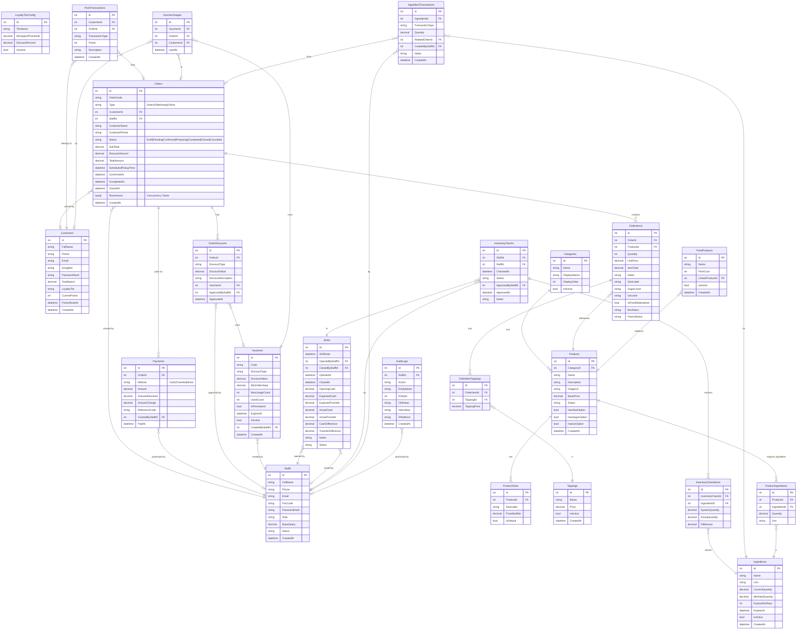

# 🗄️ Entity Relationship Diagram (ERD)
### Hệ thống Quản lý Bán hàng Quán Cà phê / Trà sữa
**Phiên bản:** 1.2 | **Ngày:** 22/06/2026

---

## Tổng quan Database Schema



---

## Mô tả chi tiết các Entity

### 📦 Staffs — Nhân viên
| Column | Type | Mô tả |
|--------|------|-------|
| PosCode | string | Mã đăng nhập POS (ví dụ: 2018000520), được hash bcrypt |
| PasswordHash | string | Mật khẩu Admin Dashboard |
| Role | enum | `Owner` `ShiftLeader` `Cashier` `Barista` `PastryStaff` |
| BaseSalary | decimal | Lương cơ bản (VNĐ) |
| Status | enum | `Active` `Inactive` |

### 👤 Customers — Khách hàng đăng ký
| Column | Type | Mô tả |
|--------|------|-------|
| Phone | string | Unique, dùng để đăng nhập và tra cứu tại POS |
| GoogleId | string | Null nếu đăng ký bằng SĐT |
| TotalSpend | decimal | Tổng chi tiêu cộng dồn vĩnh viễn (tính tier) |
| LoyaltyTier | enum | `None` `Silver` (10%) `Gold` (15%) |
| CurrentPoints | int | Điểm hiện tại (reset mỗi 2 tháng) |
| PointsResetAt | datetime | Thời điểm reset gần nhất |

### 🗂️ Categories — Danh mục
| Column | Type | Mô tả |
|--------|------|-------|
| DisplayStation | enum | `Bar` `Pastry` `Both` — quyết định hiển thị trên PDS nào |
| DisplayOrder | int | Thứ tự hiển thị trên menu |

### 🥤 Products — Sản phẩm
| Column | Type | Mô tả |
|--------|------|-------|
| Status | enum | `Active` `Inactive` `OutOfStock` |
| HasSizeOption | bool | Có chọn size S/M/L không |
| HasSugarOption | bool | Có chọn mức đường không |
| HasIceOption | bool | Có chọn mức đá không |

### 📋 Orders — Đơn hàng
| Column | Type | Mô tả |
|--------|------|-------|
| OrderCode | string | Unique, format: `CF{YYMMDD}{seq}`, ví dụ: `CF2406110001` |
| Type | enum | `DineIn` `TakeAway` `Online` |
| Status | enum | `Draft` (POS nháp) `Pending` (Online chờ duyệt) `Confirmed` `Preparing` `Completed` `Closed` `Cancelled` |
| RowVersion | byte[] | EF Core Concurrency Token phục vụ Optimistic Concurrency |

### 💳 Payments — Bản ghi thanh toán
| Column | Type | Mô tả |
|--------|------|-------|
| OrderId | int FK | Liên kết đến bảng Orders |
| Method | enum | `Cash` `Transfer` `Mixed` |
| Amount | decimal | Số tiền thực tế thu |
| AmountReceived | decimal | Số tiền khách đưa (Cash) |
| AmountChange | decimal | Tiền thối lại cho khách (Cash) |
| ReferenceCode | string | Mã đối chiếu CK / Mã đơn hàng cho VietQR |
| CreatedByStaffId | int FK | CSR thực hiện giao dịch |
| PaidAt | datetime | Thời điểm thanh toán thành công |

### 🥗 ProductIngredients — Định mức nguyên liệu (Recipe/BOM)
| Column | Type | Mô tả |
|--------|------|-------|
| ProductId | int FK | Sản phẩm liên kết |
| IngredientId | int FK | Nguyên liệu liên kết |
| Quantity | decimal | Định mức tiêu hao nguyên liệu |
| Unit | string | Đơn vị đo (`g`, `ml`, `cái`) |

### 📝 AuditLogs — Nhật ký hệ thống
| Column | Type | Mô tả |
|--------|------|-------|
| StaffId | int FK | Nhân viên thực hiện (Null nếu là hệ thống) |
| Action | enum | `CREATE` `UPDATE` `DELETE` `APPROVE` `CANCEL` `REFUND` |
| EntityName | string | Bảng bị ảnh hưởng (`Orders`, `Staffs`, `Ingredients`, `Shifts`...) |
| EntityId | int | ID bản ghi bị ảnh hưởng |
| OldValue | string | JSON snapshot trước khi đổi |
| NewValue | string | JSON snapshot sau khi đổi |
| IPAddress | string | IP client |
| CreatedAt | datetime | Thời gian ghi log |

> **Quy tắc đóng đơn:** 
> - **POS (Pay-First):** Tự động đóng (`Status = Closed`, `ClosedAt = now()`) ngay khi pha chế xong (`Status = Completed`) vì tiền đã thu trước.
> - **Online (Pay-Later COD):** Khi khách đến quầy nhận đồ, CSR thu tiền và bấm Đóng đơn trên POS -> Tạo `Payment` record và chuyển đơn sang `Closed`.

### 🍹 OrderItems — Món trong đơn
| Column | Type | Mô tả |
|--------|------|-------|
| SugarLevel | enum | `0` `30` `50` `70` `Extra` |
| IceLevel | enum | `0` `50` `100` |
| IsPointRedemption | bool | Đổi điểm → UnitPrice = 0 |
| BarStatus | enum | `NA` `Pending` `InProgress` `Done` |
| PastryStatus | enum | `NA` `Pending` `InProgress` `Done` |

### 💰 Vouchers — Mã giảm giá
| Column | Type | Mô tả |
|--------|------|-------|
| DiscountType | enum | `Percent` `Fixed` |
| MaxUsageCount | int? | Null = không giới hạn |
| IsPermanent | bool | True = không có ngày hết hạn |
| ExpiresAt | datetime? | Null nếu `IsPermanent = true` |

---

## Order Status Flow

```
POS (Dine-in / Take-away):
  [Draft] ──Thanh toán thành công──▶ [Confirmed] ──▶ [Preparing] ──▶ [Completed] ──Tự động đóng──▶ [Closed✅]

Online (COD):
  [Pending] ──CSR xác nhận──▶ [Confirmed] ──▶ [Preparing] ──▶ [Completed] ──Thu tiền và Đóng đơn──▶ [Closed✅]

Từ bất kỳ trạng thái nào trước Completed:
  ──▶ [Cancelled❌] (Kích hoạt quy trình hoàn tiền nếu đơn đã thanh toán)
```

---

## Conventions

| Quy tắc | Giá trị |
|---------|----------|
| Soft Delete | Dùng `IsActive = false` thay vì DELETE vật lý |
| Giá lưu lịch sử | `UnitPrice`, `ToppingPrice` lưu giá **tại thời điểm đặt** |
| Audit Discount | Ghi nhận chi tiết vào bảng `AuditLogs` với ID nhân viên duyệt |
| Audit Logs | Ghi nhật ký cho discount, mở/đóng ca, hủy đơn, hoàn tiền, duyệt kho, sửa nhân viên |
| Point Reset | Scheduled job mỗi 2 tháng, tạo `PointTransaction` type `Reset` |
| Order Code | Reset sequence mỗi ngày (theo ngày trong code) |
| Concurrency | Optimistic Concurrency với `RowVersion` (byte[]) trên bảng `Orders` |
| InventoryCheck Status | `PendingApproval` → `Approved` — SL tạo, Owner duyệt mới cập nhật kho |
| In ấn | Không có trong phạm vi hiện tại |
| Huỷ món Online | CSR xóa `OrderItem` khi đơn ở `Pending` — Hệ thống recalculate tổng đơn |
